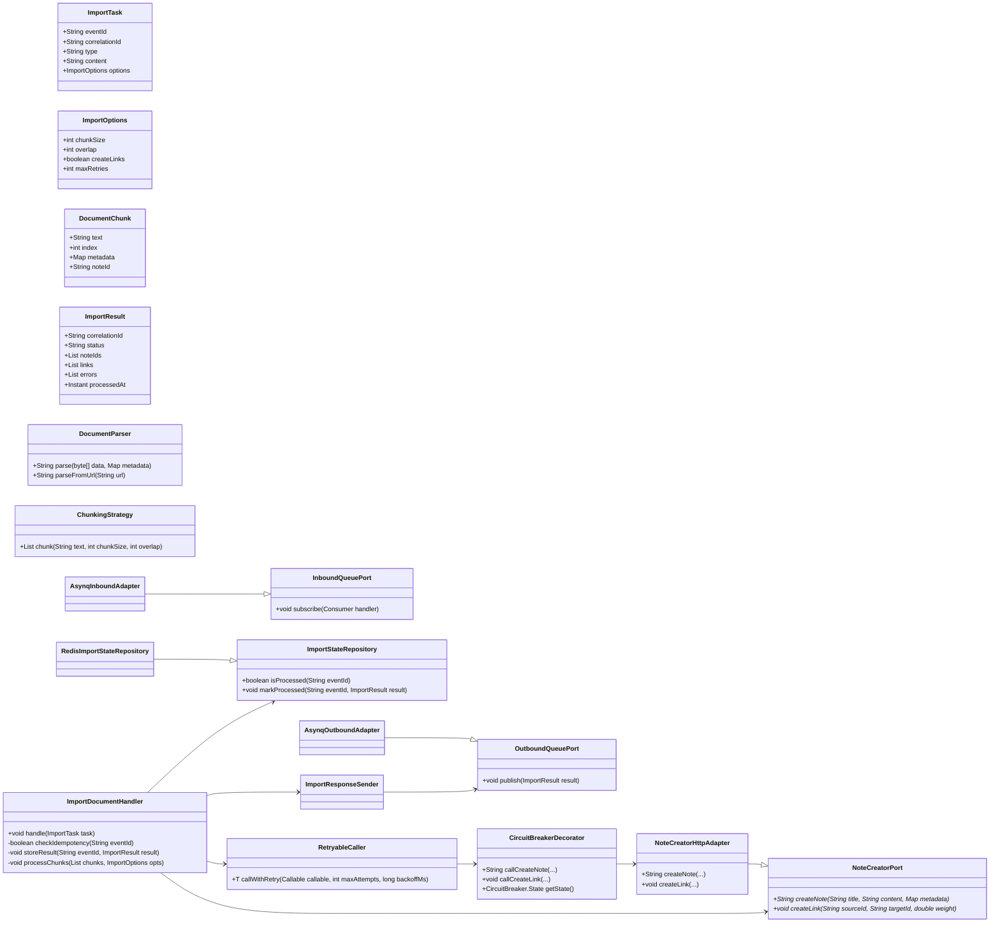

```mermaid
classDiagram
    direction LR

    %% Domain Layer
    class ImportTask {
        +String eventId
        +String correlationId
        +String type
        +String content
        +ImportOptions options
    }
    class ImportOptions {
        +int chunkSize
        +int overlap
        +boolean createLinks
        +int maxRetries
    }
    class DocumentChunk {
        +String text
        +int index
        +Map metadata
        +String noteId
    }
    class ImportResult {
        +String correlationId
        +String status
        +List noteIds
        +List links
        +List errors
        +Instant processedAt
    }

    %% Domain Services (interfaces)
    class DocumentParser {
        +String parse(byte[] data, Map metadata)
        +String parseFromUrl(String url)
    }
    class ChunkingStrategy {
        +List chunk(String text, int chunkSize, int overlap)
    }

    %% Application Layer
    class ImportDocumentHandler {
        +void handle(ImportTask task)
        -boolean checkIdempotency(String eventId)
        -void storeResult(String eventId, ImportResult result)
        -void processChunks(List chunks, ImportOptions opts)
    }

    %% Ports (interfaces)
    class InboundQueuePort {
        +void subscribe(Consumer handler)
    }
    class OutboundQueuePort {
        +void publish(ImportResult result)
    }
    class NoteCreatorPort {
        +String createNote(String title, String content, Map metadata)*
        +void createLink(String sourceId, String targetId, double weight)*
    }
    class ImportStateRepository {
        +boolean isProcessed(String eventId)
        +void markProcessed(String eventId, ImportResult result)
    }

    %% Infrastructure with Circuit Breaker
    class NoteCreatorHttpAdapter {
        +String createNote(...)
        +void createLink(...)
    }
    class CircuitBreakerDecorator {
        +String callCreateNote(...)
        +void callCreateLink(...)
        +CircuitBreaker.State getState()
    }
    class RetryableCaller {
        +T callWithRetry(Callable callable, int maxAttempts, long backoffMs)
    }

    class AsynqInboundAdapter
    class AsynqOutboundAdapter
    class RedisImportStateRepository
    class ImportResponseSender

    AsynqInboundAdapter --|> InboundQueuePort
    AsynqOutboundAdapter --|> OutboundQueuePort
    RedisImportStateRepository --|> ImportStateRepository
    NoteCreatorHttpAdapter --|> NoteCreatorPort

    ImportDocumentHandler --> NoteCreatorPort
    ImportDocumentHandler --> ImportStateRepository
    ImportDocumentHandler --> ImportResponseSender

    ImportResponseSender --> OutboundQueuePort

    CircuitBreakerDecorator --> NoteCreatorHttpAdapter
    RetryableCaller --> CircuitBreakerDecorator
    ImportDocumentHandler --> RetryableCaller
```
