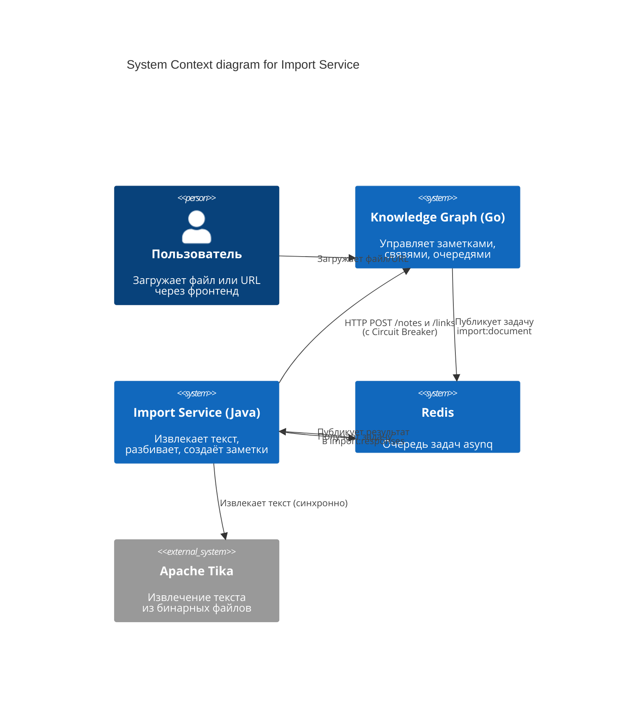

```mermaid
%%{init: {'theme': 'base', 'flowchart': {'curve': 'linear'}}}%%
C4Context
    title System Context diagram for Import Service

    Person(user, "Пользователь", "Загружает файл или URL<br>через фронтенд")
    System(knowledge_graph, "Knowledge Graph (Go)", "Управляет заметками,<br>связями, очередями")
    System(import_service, "Import Service (Java)", "Извлекает текст,<br>разбивает, создаёт заметки")
    System(redis, "Redis", "Очередь задач asynq")
    System_Ext(tika, "Apache Tika", "Извлечение текста<br>из бинарных файлов")

    Rel(user, knowledge_graph, "Загружает файл/URL")
    Rel(knowledge_graph, redis, "Публикует задачу<br>import:document")
    Rel(redis, import_service, "Получает задачу")
    Rel(import_service, tika, "Извлекает текст (синхронно)")
    Rel(import_service, knowledge_graph, "HTTP POST /notes и /links<br>(с Circuit Breaker)")
    Rel(import_service, redis, "Публикует результат<br>в import:responses")
```
