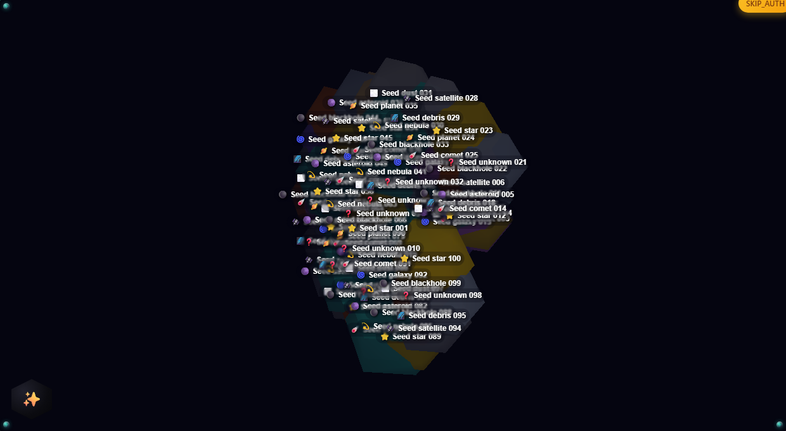

# 🌌 Knowledge Graph

<div align="center">

[](https://github.com/Killaret/knowledge-graph/actions/workflows/main.yml)
[](LICENSE)


**A personal knowledge base where notes form a graph you can fly through.**

[Русская версия](README.ru.md) • [Quick Start](#-quick-start) • [Architecture](#️-architecture) • [Engineering](#-engineering-practices) • [Documentation](#-documentation)



</div>

---

## What it is

Notes are nodes; links between them are edges. An NLP service embeds every note
into a multilingual vector space, so related notes attract each other whether
they were written in Russian or English. The result is rendered as a navigable
3D scene — stars, planets, comets — or as a conventional 2D graph.

Published notes form a public community graph that anyone can browse without an
account; signing in switches the view to your own.

## Provenance

The project began with a problem of the author's own: notes accumulating faster
than any structure to hold them, and no tool that treated the links between them
as the primary object rather than an afterthought.

The product model and the architecture are the author's, as is every decision in
[`docs/architecture/decisions/`](docs/architecture/decisions/) — put forward as a
hypothesis, worked through, argued with colleagues where that helped, then
accepted or rejected on the merits. The rejected options are recorded next to the
chosen ones, because they are the part that shows the reasoning. The system was
built by the author.

AI agents joined later, and they work under a written protocol: one implements,
another reviews, never both in the same session, and neither may alter its own
constraints. What gets built, and the criteria it is held to, are decided outside
them.

---

## ✨ Features

- **3D visualisation** — notes as celestial bodies, with camera navigation and adaptive fog
- **Graph structure** — typed links between notes, weighted by semantic similarity
- **Multilingual semantics** — one embedding space for 50+ languages, so «машинное обучение» and "machine learning" sit together
- **Semantic search** — pgvector similarity over note embeddings
- **Recommendations** — precomputed suggestions from graph distance and semantics
- **Public community graph** — published notes are browsable anonymously
- **Drafts** — autosaved to MongoDB while you type
- **Authentication** — JWT, API keys, OAuth2 (Yandex)
- **Achievements** — lightweight gamification
- **Cloud backup** — scheduled backup to Yandex.Disk

---

## 🚀 Quick Start

### Prerequisites

Docker and Docker Compose. Everything else runs in containers; Go 1.25+,
Node.js 20+ and Python 3.11+ are only needed to run services directly.

### Start

```bash
# Development stack
docker compose up -d

# Personal instance (separate ports and volumes)
docker compose -f docker-compose.personal.yml up -d

# Isolated test stack, destroyed after use
docker compose -f docker-compose.test.yml up -d --build
```

Convenience scripts for the test stack:

```powershell
.\scripts\testing\start-test.ps1       # start
.\scripts\testing\seed-test-data.ps1   # populate with deterministic data
.\scripts\testing\stop-test.ps1        # stop and destroy
```

### Where things listen

| Stack | Frontend | API gateway | Notes |
|---|---|---|---|
| Development | http://localhost:18081 | http://localhost:18080 | Vite dev server on 5173 |
| Personal | http://localhost:18084 | http://localhost:18082 | your real data lives here |
| Test | http://localhost:3002 | http://localhost:18083 | isolated, disposable |

Full port map: [`docs/DOCKER.md`](docs/DOCKER.md).

### Running services directly

```bash
cd backend      && go run ./cmd/server
cd frontend     && npm run dev
cd nlp-service  && uvicorn app.main:app --reload
```

---

## 🏗️ Architecture

Four services behind an nginx gateway.

```
                    ┌──────────────┐
                    │    nginx     │  gateway, CORS, security headers
                    └──────┬───────┘
          ┌────────────────┼────────────────┐
          ▼                ▼                ▼
   ┌────────────┐   ┌────────────┐   ┌───────────────┐
   │  Frontend  │   │  Backend   │   │ Graph Service │
   │ SvelteKit  │──►│    Go      │──►│  Go, gRPC +   │
   │  Svelte 5  │   │  Gin/GORM  │   │     HTTP      │
   └────────────┘   └─────┬──────┘   └───────┬───────┘
                          │                  │
                ┌─────────┼──────────┐       │
                ▼         ▼          ▼       ▼
         ┌───────────┐ ┌──────┐ ┌───────┐ ┌─────────┐
         │PostgreSQL │ │Redis │ │MongoDB│ │   NLP   │
         │ +pgvector │ │cache │ │drafts │ │ FastAPI │
         └───────────┘ └──────┘ └───────┘ └─────────┘
```

**Backend** follows Clean Architecture — `domain`, `application`,
`infrastructure`, `interfaces` — with the boundaries enforced by `depguard`
rather than by convention. **Frontend** follows Feature-Sliced Design layered
over Atomic Design, with import rules enforced by ESLint.

**Graph Service** is a separate Go service computing layout and traversal over
the note graph, with pub/sub cache invalidation. **NLP Service** produces
embeddings and extracts keywords.

Decision records: 18 ADRs in [`docs/architecture/decisions/`](docs/architecture/decisions/),
C4 model and UML in [`docs/architecture/`](docs/architecture/README.md).

---

## 🔬 Engineering practices

The part of this project worth reading is not the feature list.

**A test is not trusted until it has been seen red.** Every guard here was
verified by breaking the thing it guards and watching the test fail — layer
rules, coverage gates, the note access model, the CI drift detector. A green
suite that has never failed is indistinguishable from no suite at all.

**Rules are enforced by machines, not by memory.** Architectural boundaries run
through `depguard` and ESLint import rules. Generated configuration is
regenerated in CI and the build fails on drift. The local check runner compares
itself against the CI workflow and fails when they diverge. Documentation links
and documented commands are verified on every run.

**One local command mirrors CI.** `scripts/testing/check-all.ps1` runs the same
sixteen phases the pipeline runs, reports every unavailable tool as an explicit
skip with a reason, and exits non-zero when anything fails.

**Two AI agents, separated by role.** Implementation and review never happen in
the same session, and neither agent may write its own constraints. The protocol
is in [`docs/AI_AGENT_PROTOCOL.md`](docs/AI_AGENT_PROTOCOL.md), the working
board in [`docs/AI_HANDOFF.md`](docs/AI_HANDOFF.md); both are kept in Russian by
project convention.

An external audit of the repository, its 22 findings and their resolution are
recorded in [`docs/EXTERNAL_AUDIT_2026-09.md`](docs/EXTERNAL_AUDIT_2026-09.md).

---

## 💻 Technology Stack

| Layer | Choices |
|---|---|
| **Backend** | Go 1.25, Gin, GORM, pgx/v5, asynq |
| **Frontend** | SvelteKit, Svelte 5 runes, TypeScript, Three.js |
| **Graph Service** | Go 1.25, gRPC + HTTP |
| **NLP** | Python 3.11, FastAPI, sentence-transformers, YAKE |
| **Data** | PostgreSQL 16 + pgvector, Redis 7, MongoDB |
| **Infrastructure** | Docker Compose, nginx |
| **Testing** | testify + testcontainers, Vitest, Playwright, Cucumber, Argos |

---

## 📁 Project Structure

```
knowledge-graph/
├── backend/                  # Go API and workers
│   ├── cmd/                  # server, worker, seed, cli, embed-recompute
│   ├── internal/
│   │   ├── domain/           # entities and value objects
│   │   ├── application/      # use cases
│   │   ├── infrastructure/   # persistence, cache, queue
│   │   └── interfaces/       # HTTP handlers and middleware
│   └── migrations/           # 30 SQL migrations
├── frontend/                 # SvelteKit, Feature-Sliced Design
│   └── src/
│       ├── shared/           # primitives, API clients, stores
│       ├── entities/         # domain-bound UI
│       ├── features/         # user-facing capabilities
│       ├── widgets/          # composed blocks
│       ├── components/       # atoms, molecules, organisms
│       └── routes/           # pages
├── services/graph-service/   # graph layout and traversal
├── nlp-service/              # embeddings and keywords
├── docs/                     # architecture, ADRs, operations, testing
├── scripts/                  # testing, cleanup, devops
└── tests/                    # BDD suites
```

---

## 🧪 Testing

993 frontend unit tests across 109 files, 47 Go packages under test in the
backend plus the graph service, integration tests on real containers via
testcontainers, E2E and BDD through Playwright, and visual regression through
Argos.

```bash
# everything CI runs, locally
.\scripts\testing\check-all.ps1
.\scripts\testing\check-all.ps1 -Quick    # skip integration

# individually
cd backend     && go test ./...
cd backend     && go test -tags=integration -p=1 ./...
cd frontend    && npm run test:unit
cd nlp-service && pytest
```

The full regression cycle, which raises an isolated stack and tears it down
afterwards, is documented in [`docs/REGRESSION_TEST_PLAN.md`](docs/REGRESSION_TEST_PLAN.md).

---

## 🔒 Security

- Object-level authorisation on every note route: foreign private notes answer
  `404`, so their existence is not confirmable
- Public and internal perimeters are separated — the gateway strips internal
  headers, and the graph service gates header trust behind an off-by-default flag
- Private responses are `Cache-Control: private` with `Vary`
- Access tokens are never accepted from the query string; OAuth uses PKCE `S256`
- The test-only auth bypass refuses to start outside a test environment
- `npm ci` only in CI, `minimumReleaseAge` in `.npmrc`, `npm audit` gating,
  Dependabot, and dependency review on pull requests

---

## 🛠️ Development

```bash
git clone https://github.com/Killaret/knowledge-graph.git
cd knowledge-graph

cd backend     && go mod download
cd ../frontend && npm install
cd ../nlp-service && pip install -r requirements.txt
```

Code quality:

```bash
cd backend  && golangci-lint run
cd frontend && npm run lint     # check only; npm run lint:fix to apply
cd frontend && npm run check    # svelte-check
```

Command reference: [`COMMANDS.md`](COMMANDS.md).

---

## 📚 Documentation

Directory index: [`docs/README.md`](docs/README.md).

| Topic | Document |
|---|---|
| Where the project is going | [`ROADMAP.md`](ROADMAP.md), [`docs/BACKLOG.md`](docs/BACKLOG.md), [`docs/IDEAS.md`](docs/IDEAS.md) |
| What shipped | [`CHANGELOG.md`](CHANGELOG.md) |
| Architecture | [`docs/architecture/README.md`](docs/architecture/README.md), [`docs/ARCHITECTURE_SUMMARY.md`](docs/ARCHITECTURE_SUMMARY.md) |
| Deployment and configuration | [`docs/DEPLOYMENT_EN.md`](docs/DEPLOYMENT_EN.md), [`docs/CONFIGURATION_EN.md`](docs/CONFIGURATION_EN.md), [`docs/DOCKER.md`](docs/DOCKER.md) |
| API contract | [`docs/API_EN.md`](docs/API_EN.md), [`backend/openAPI.yaml`](backend/openAPI.yaml) |
| Testing | [`docs/TESTING.md`](docs/TESTING.md), [`docs/REGRESSION_TEST_PLAN.md`](docs/REGRESSION_TEST_PLAN.md), [`docs/ARGOS.md`](docs/ARGOS.md) |
| Backup | [`docs/BACKUP.md`](docs/BACKUP.md) |
| Graph service auth | [`docs/GRAPH_SERVICE_AUTH.md`](docs/GRAPH_SERVICE_AUTH.md) |
| Recommendations | [`docs/RECOMMENDATION_ARCHITECTURE.md`](docs/RECOMMENDATION_ARCHITECTURE.md) |

---

## 🤝 Contributing

This is a personal project, but the conventions are written down and enforced:
[`.windsurfrules`](.windsurfrules) is the single normative source for
architecture, testing, security and language policy.

Two rules matter most. Documentation is updated in the same change that alters
behaviour, not afterwards. And a search locates a candidate but never confirms
one — findings are confirmed by reading the context or by running the thing.

---

## 📄 License

MIT — see [`LICENSE`](LICENSE).

---

## 🙏 Acknowledgments

Three.js, Svelte, Gin, PostgreSQL with pgvector, and sentence-transformers.
