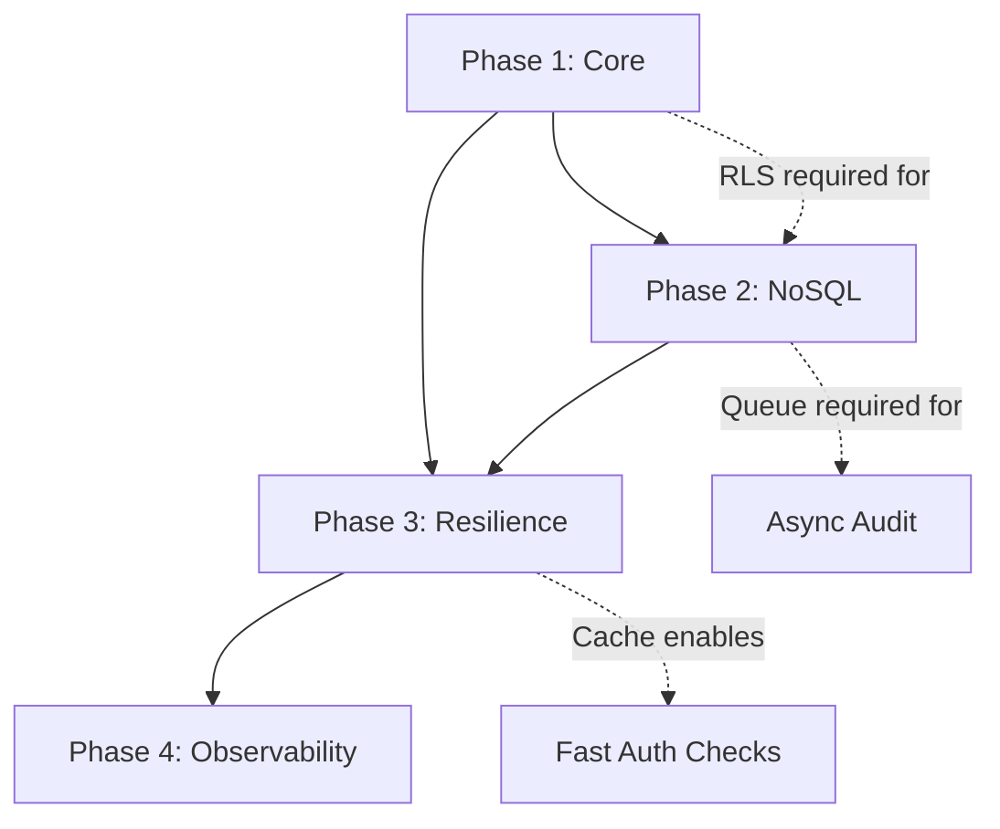

# Architecture Roadmap: SaaS Migration

## Executive Summary

This roadmap defines the phased migration from single-user MVP to **multi-tenant SaaS architecture**. Each phase delivers incremental value while maintaining system stability.

**North Star Goal**: Production-grade SaaS demonstrating Senior System Architect competencies:
- Strict Multi-tenancy (RLS-enforced isolation)
- Security by Design (Defense in Depth)
- Resilience & Scalability (Circuit breakers, queues)
- Observability & Compliance (Audit trails, 90-day retention)

---

## Phase 1: Core SaaS Foundation
*Focus: Tenants, RLS, Auth, Migration Script*

| ID | Deliverable | Technical Implementation | Status |
|----|-------------|--------------------------|--------|
| **P1-01** | **Tenants Domain Model** | `Tenant` aggregate root, `TenantRepository`, `Slug` value object | ⬜ |
| **P1-02** | **Tenant Memberships** | `tenant_memberships` table linking `user_id` → `tenant_id` + `role` | ⬜ |
| **P1-03** | **RBAC Foundation** | `roles` table with JSONB `permissions`, system roles (owner/admin/member) | ⬜ |
| **P1-04** | **JWT Tenant Context** | Auth middleware extracts `tenant_id` from JWT, sets `app.current_tenant_id` | ⬜ |
| **P1-05** | **PostgreSQL RLS** | `CREATE POLICY tenant_isolation` on all tables, `FORCE ROW LEVEL SECURITY` | ⬜ |
| **P1-06** | **Soft Delete Columns** | Add `deleted_at` to `notes`, `links`, `embeddings` tables | ⬜ |
| **P1-07** | **Migration Script** | Maintenance window script: backfill `tenant_id`, create tenants, enable RLS | ⬜ |
| **P1-08** | **Rollback Plan** | Full DB snapshot procedure, rollback tested in staging | ⬜ |

### Phase 1 Definition of Done
- [ ] All tables have `tenant_id` with FK constraints
- [ ] RLS policies active and tested with multiple tenants
- [ ] Existing users migrated to owner role in personal tenants
- [ ] Migration runbook documented and tested

---

## Phase 2: NoSQL Integration
*Focus: MongoDB integration for Logs and Drafts*

| ID | Deliverable | Technical Implementation | Status |
|----|-------------|--------------------------|--------|
| **P2-01** | **MongoDB Connection** | `MongoClient` wrapper with circuit breaker, connection pooling | ⬜ |
| **P2-02** | **Audit Log Schema** | `audit_logs` collection: `{timestamp, tenant_id, user_id, action, resource, metadata, ip, user_agent}` | ⬜ |
| **P2-03** | **TTL Index (90 days)** | `db.audit_logs.createIndex({timestamp: 1}, {expireAfterSeconds: 7776000})` | ⬜ |
| **P2-04** | **Async Audit Pipeline** | Middleware extracts context → Redis queue → Worker persists to MongoDB | ⬜ |
| **P2-05** | **Drafts Collection** | `drafts` collection: `{note_id, user_id, content, version, last_saved_at}` | ⬜ |
| **P2-06** | **Autosave Handler** | `SaveDraftHandler` with optimistic locking (version-based conflict detection) | ⬜ |
| **P2-07** | **Draft TTL (30 days)** | Auto-cleanup abandoned drafts: `expireAfterSeconds: 2592000` | ⬜ |
| **P2-08** | **Publish Sync** | `PublishNoteHandler`: Draft → Postgres transaction → MongoDB draft deletion | ⬜ |

### Phase 2 Definition of Done
- [ ] Audit logs flowing to MongoDB with 90-day TTL
- [ ] Draft autosave < 100ms latency
- [ ] Publish operation atomic (Postgres commit + MongoDB cleanup)
- [ ] Fallback to local file if MongoDB unavailable

---

## Phase 3: Resilience Infrastructure
*Focus: Redis Queues, Circuit Breakers*

| ID | Deliverable | Technical Implementation | Status |
|----|-------------|--------------------------|--------|
| **P3-01** | **Redis Queue Abstraction** | `Queue` interface: `Enqueue()`, `Dequeue()`, `DequeueBatch()` | ⬜ |
| **P3-02** | **Job Worker Framework** | `Worker` interface with retry logic, exponential backoff, dead letter queue | ⬜ |
| **P3-03** | **Embedding Job Queue** | Async embedding generation: Redis queue → Worker → OpenAI API → Postgres | ⬜ |
| **P3-04** | **Email Job Queue** | Async email sending with template rendering | ⬜ |
| **P3-05** | **Circuit Breaker (Redis)** | `sony/gobreaker`: 5 errors/30s → Open, 3 test requests in half-open | ⬜ |
| **P3-06** | **Circuit Breaker (MongoDB)** | 5 consecutive errors → Open, local file fallback | ⬜ |
| **P3-07** | **Circuit Breaker (External APIs)** | OpenAI API protected: 60% failure/60s threshold | ⬜ |
| **P3-08** | **Permission Cache** | Redis cache for `roles.permissions` with invalidation on role update | ⬜ |
| **P3-09** | **Cleanup Job Worker** | Daily job: hard-delete records where `deleted_at > 30 days` | ⬜ |

### Phase 3 Definition of Done
- [ ] All external dependencies have circuit breaker protection
- [ ] Queue workers process 1000+ jobs/minute
- [ ] Permission cache reduces DB lookups by 90%+
- [ ] Cleanup job runs without blocking user operations

---

## Phase 4: Observability & Hardening
*Focus: Dashboards, Alerting, Chaos Testing*

| ID | Deliverable | Technical Implementation | Status |
|----|-------------|--------------------------|--------|
| **P4-01** | **Structured Logging** | `slog` with JSON output, correlation IDs, tenant context | ⬜ |
| **P4-02** | **Metrics Collection** | Prometheus metrics: request latency, RLS policy efficiency, cache hit rates | ⬜ |
| **P4-03** | **Circuit Breaker Metrics** | Alert on state changes: Open → Half-Open, Half-Open → Closed | ⬜ |
| **P4-04** | **Queue Depth Monitoring** | Alert when `audit:queue` > 10,000 events | ⬜ |
| **P4-05** | **Tenant Leak Detection** | Chaos test: intentionally bypass app auth, verify RLS blocks access | ⬜ |
| **P4-06** | **Load Testing** | k6 multi-tenant load test: verify "noisy neighbor" isolation | ⬜ |
| **P4-07** | **Security Audit** | Penetration test: SQL injection attempt, verify RLS containment | ⬜ |
| **P4-08** | **Runbook Documentation** | Incident response: circuit breaker tripped, MongoDB failover, RLS bypass | ⬜ |

### Phase 4 Definition of Done
- [ ] 99.9% of RLS policies execute without seq scan
- [ ] Circuit breaker alerts trigger PagerDuty within 30 seconds
- [ ] Chaos tests prove RLS prevents cross-tenant access even with app bugs
- [ ] Load tests confirm < 200ms p99 response time under 10x normal load

---

## Dependencies Graph

## Timeline Estimate

| Phase | Duration | Cumulative |
|-------|----------|------------|
| Phase 1 | 3-4 weeks | Week 4 |
| Phase 2 | 2-3 weeks | Week 7 |
| Phase 3 | 2-3 weeks | Week 10 |
| Phase 4 | 2 weeks | Week 12 |

## Risk Register

| Risk | Likelihood | Impact | Mitigation |
|------|------------|--------|------------|
| RLS performance degradation | Medium | High | Index `tenant_id` on all tables, EXPLAIN ANALYZE all queries |
| Migration data corruption | Low | Critical | Full backup, tested rollback, dry-run in staging |
| MongoDB write bottleneck | Medium | Medium | Bulk inserts, worker auto-scaling, fallback to file |
| Circuit breaker flapping | Medium | Low | Tuned thresholds (30s window, not instantaneous) |
| JWT token size (permissions) | Medium | Medium | Wildcard permissions, cache in Redis |

## Success Metrics

| Metric | Target | Measurement |
|--------|--------|-------------|
| Tenant isolation | 100% | Chaos test: 0 cross-tenant data access |
| Draft save latency | < 100ms | p99 from API gateway |
| API response time | < 200ms | p99 for list queries |
| Audit log coverage | 100% | All API calls generate audit event |
| Permission check latency | < 10ms | JWT claims, no DB hit |
| Migration downtime | < 1 hour | Maintenance window |

## References

- [ADR 001: Layered Architecture](./architecture/decisions/001-layered-architecture.md)
- [ADR 003: Multi-Tenancy Strategy](./architecture/decisions/003-multi-tenancy-strategy.md)
- [ADR 008: Data Migration Plan](./architecture/decisions/008-data-migration-plan.md)
- [SaaS Database Schema](./SaaS_DATABASE_SCHEMA.md)
