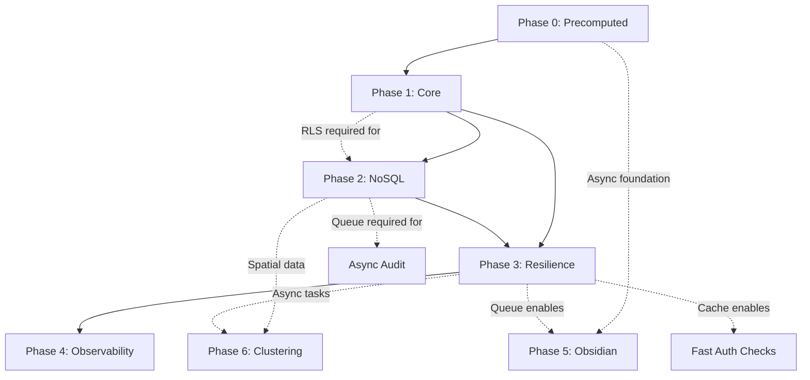

# Architecture Roadmap: SaaS Migration

## Executive Summary

This roadmap defines the phased migration from single-user MVP to **multi-tenant SaaS architecture**. Each phase delivers incremental value while maintaining system stability.

**North Star Goal**: Production-grade SaaS demonstrating Senior System Architect competencies:
- Strict Multi-tenancy (RLS-enforced isolation)
- Security by Design (Defense in Depth)
- Resilience & Scalability (Circuit breakers, queues)
- Observability & Compliance (Audit trails, 90-day retention)

---

## Phase 0: Precomputed Recommendations (In Progress)
*Focus: Remove synchronous fallbacks, stabilize async architecture*

| ID | Deliverable | Technical Implementation | Status |
|----|-------------|--------------------------|--------|
| **P0-01** | **CLI Backfill** | Fill `note_recommendations` for all existing notes | ⬜ |
| **P0-02** | **Fallback Toggle** | Config `RECOMMENDATION_FALLBACK_ENABLED`, default `false` | ⬜ |
| **P0-03** | **Queue Monitoring** | Deploy `asynqmon`, set up alerts for queue depth | ⬜ |
| **P0-04** | **API Response Update** | Add `status: "ready" | "pending"` to `/suggestions` | ⬜ |
| **P0-05** | **UI Status Indicator** | Show "Рекомендации рассчитываются" for pending state | ⬜ |

### Phase 0 Definition of Done
- [ ] All existing notes have precomputed recommendations
- [ ] Fallbacks disabled by default, API reads only from table
- [ ] Queue monitoring alerts configured
- [ ] Frontend handles empty recommendations gracefully
- [ ] Rollback procedure tested (emergency fallback enable)

---

## Phase 1: Core SaaS Foundation
*Focus: Tenants, RLS, Auth, Migration Script*

| ID | Deliverable | Technical Implementation | Status |
|----|-------------|--------------------------|--------|
| **P1-01** | **Tenants Domain Model** | `Tenant` aggregate root, `TenantRepository`, `Slug` value object | ⬜ |
| **P1-02** | **Tenant Memberships** | `tenant_memberships` table linking `user_id` → `tenant_id` + `role` | ⬜ |
| **P1-03** | **RBAC Foundation** | `roles` table with JSONB `permissions`, system roles (owner/admin/member) | ⬜ |
| **P1-04** | **JWT Tenant Context** | Auth middleware extracts `tenant_id` from JWT, sets `app.current_tenant_id` | ⬜ |
| **P1-05** | **PostgreSQL RLS** | `CREATE POLICY tenant_isolation` on all tables, `FORCE ROW LEVEL SECURITY` | ⬜ |
| **P1-06** | **Soft Delete Columns** | Add `deleted_at` to `notes`, `links`, `embeddings` tables | ⬜ |
| **P1-07** | **Migration Script** | Maintenance window script: backfill `tenant_id`, create tenants, enable RLS | ⬜ |
| **P1-08** | **Rollback Plan** | Full DB snapshot procedure, rollback tested in staging | ⬜ |

### Phase 1 Definition of Done
- [ ] All tables have `tenant_id` with FK constraints
- [ ] RLS policies active and tested with multiple tenants
- [ ] Existing users migrated to owner role in personal tenants
- [ ] Migration runbook documented and tested

---

## Phase 2: NoSQL Integration
*Focus: MongoDB integration for Logs and Drafts*

| ID | Deliverable | Technical Implementation | Status |
|----|-------------|--------------------------|--------|
| **P2-01** | **MongoDB Connection** | `MongoClient` wrapper with circuit breaker, connection pooling | ⬜ |
| **P2-02** | **Audit Log Schema** | `audit_logs` collection: `{timestamp, tenant_id, user_id, action, resource, metadata, ip, user_agent}` | ⬜ |
| **P2-03** | **TTL Index (90 days)** | `db.audit_logs.createIndex({timestamp: 1}, {expireAfterSeconds: 7776000})` | ⬜ |
| **P2-04** | **Async Audit Pipeline** | Middleware extracts context → Redis queue → Worker persists to MongoDB | ⬜ |
| **P2-05** | **Drafts Collection** | `drafts` collection: `{note_id, user_id, content, version, last_saved_at}` | ⬜ |
| **P2-06** | **Autosave Handler** | `SaveDraftHandler` with optimistic locking (version-based conflict detection) | ⬜ |
| **P2-07** | **Draft TTL (30 days)** | Auto-cleanup abandoned drafts: `expireAfterSeconds: 2592000` | ⬜ |
| **P2-08** | **Publish Sync** | `PublishNoteHandler`: Draft → Postgres transaction → MongoDB draft deletion | ⬜ |

### Phase 2 Definition of Done
- [ ] Audit logs flowing to MongoDB with 90-day TTL
- [ ] Draft autosave < 100ms latency
- [ ] Publish operation atomic (Postgres commit + MongoDB cleanup)
- [ ] Fallback to local file if MongoDB unavailable

---

## Phase 3: Resilience Infrastructure
*Focus: Redis Queues, Circuit Breakers*

| ID | Deliverable | Technical Implementation | Status |
|----|-------------|--------------------------|--------|
| **P3-01** | **Redis Queue Abstraction** | `Queue` interface: `Enqueue()`, `Dequeue()`, `DequeueBatch()` | ⬜ |
| **P3-02** | **Job Worker Framework** | `Worker` interface with retry logic, exponential backoff, dead letter queue | ⬜ |
| **P3-03** | **Embedding Job Queue** | Async embedding generation: Redis queue → Worker → OpenAI API → Postgres | ⬜ |
| **P3-04** | **Email Job Queue** | Async email sending with template rendering | ⬜ |
| **P3-05** | **Circuit Breaker (Redis)** | `sony/gobreaker`: 5 errors/30s → Open, 3 test requests in half-open | ⬜ |
| **P3-06** | **Circuit Breaker (MongoDB)** | 5 consecutive errors → Open, local file fallback | ⬜ |
| **P3-07** | **Circuit Breaker (External APIs)** | OpenAI API protected: 60% failure/60s threshold | ⬜ |
| **P3-08** | **Permission Cache** | Redis cache for `roles.permissions` with invalidation on role update | ⬜ |
| **P3-09** | **Cleanup Job Worker** | Daily job: hard-delete records where `deleted_at > 30 days` | ⬜ |

### Phase 3 Definition of Done
- [ ] All external dependencies have circuit breaker protection
- [ ] Queue workers process 1000+ jobs/minute
- [ ] Permission cache reduces DB lookups by 90%+
- [ ] Cleanup job runs without blocking user operations

---

## Phase 4: Observability & Hardening
*Focus: Dashboards, Alerting, Chaos Testing*

| ID | Deliverable | Technical Implementation | Status |
|----|-------------|--------------------------|--------|
| **P4-01** | **Structured Logging** | `slog` with JSON output, correlation IDs, tenant context | ⬜ |
| **P4-02** | **Metrics Collection** | Prometheus metrics: request latency, RLS policy efficiency, cache hit rates | ⬜ |
| **P4-03** | **Circuit Breaker Metrics** | Alert on state changes: Open → Half-Open, Half-Open → Closed | ⬜ |
| **P4-04** | **Queue Depth Monitoring** | Alert when `audit:queue` > 10,000 events | ⬜ |
| **P4-05** | **Tenant Leak Detection** | Chaos test: intentionally bypass app auth, verify RLS blocks access | ⬜ |
| **P4-06** | **Load Testing** | k6 multi-tenant load test: verify "noisy neighbor" isolation | ⬜ |
| **P4-07** | **Security Audit** | Penetration test: SQL injection attempt, verify RLS containment | ⬜ |
| **P4-08** | **Runbook Documentation** | Incident response: circuit breaker tripped, MongoDB failover, RLS bypass | ⬜ |

### Phase 4 Definition of Done
- [ ] 99.9% of RLS policies execute without seq scan
- [ ] Circuit breaker alerts trigger PagerDuty within 30 seconds
- [ ] Chaos tests prove RLS prevents cross-tenant access even with app bugs
- [ ] Load tests confirm < 200ms p99 response time under 10x normal load

---

## Phase 6: Hierarchical Clustering for Zoom Visualization
*Focus: Multi-level keyword clustering for interactive graph exploration*

**Why:** As the knowledge graph grows, users need ways to explore it at different zoom levels. Hierarchical clustering groups semantically related keywords into thematic clusters that become visible at appropriate zoom levels, providing a mental map of the knowledge space.

| ID | Deliverable | Technical Implementation | Status |
|----|-------------|--------------------------|--------|
| **P6-01** | **Schema Extensions** | `keyword_embeddings`, `keyword_clusters`, `cluster_spatial` tables | ⬜ |
| **P6-02** | **Clustering Algorithm** | Iterative soft clustering with semantic + co-occurrence similarity | ⬜ |
| **P6-03** | **Spatial Precomputation** | Materialized `cluster_spatial` with centroids, radii, bounding boxes | ⬜ |
| **P6-04** | **Versioning System** | Cluster tree versioning for UI stability between sessions | ⬜ |
| **P6-05** | **Clustering API** | `/clusters/by-zoom`, `/clusters/tree`, `/clusters/diff` endpoints | ⬜ |
| **P6-06** | **Asynq Integration** | `ClusterRebuildTask` for periodic full reclustering | ⬜ |
| **P6-07** | **Manual Labeling** | Admin API for user-defined cluster names | ⬜ |
| **P6-08** | **Frontend Integration** | Zoom-aware cluster rendering with smooth transitions | ⬜ |

### Technical Decisions

- **Similarity Metric:** Combined cosine (embeddings) + weighted Jaccard (co-occurrence), λ=0.7
- **Clustering Method:** Graph-based connectivity with threshold=0.2, max 4-5 levels
- **Stability Strategy:** Versioned cluster trees, explicit user refresh required
- **Performance:** Precomputed spatial data, no JOINs during `/clusters/by-zoom` queries

### Estimation

- **Backend:** 5-7 days (algorithm, API, versioning, async tasks)
- **Frontend:** 3-4 days (zoom integration, cluster rendering, animations)
- **Testing:** 2-3 days (clustering accuracy, performance with 1000+ notes)

### Phase 6 Definition of Done
- [ ] Clustering algorithm produces stable, meaningful keyword groups
- [ ] API returns clusters in < 50ms for any zoom level
- [ ] Versioning prevents UI disruption between sessions
- [ ] Spatial precomputation handles 1000+ notes efficiently
- [ ] Smooth animations between zoom levels
- [ ] Manual cluster renaming persisted and displayed

**Specification:** [Hierarchical Clustering Specification](./architecture/clustering.md)

---

## Phase 5: Obsidian Import (Killer Feature)
*Focus: Import from Obsidian vaults with link preservation*

**Why:** Obsidian is the de-facto standard for personal knowledge bases. Millions of users store notes as Markdown files with internal links `[[...]]`. Importing them into Knowledge Graph with preserved connections instantly gives users a ready-made graph without manual input.

| ID | Deliverable | Technical Implementation | Status |
|----|-------------|--------------------------|--------|
| **P5-01** | **Upload Endpoint** | `POST /import/obsidian` (multipart/form-data with ZIP or directory path) | ⬜ |
| **P5-02** | **Markdown Parser** | Extract title (filename or `#`), content, `[[target]]` and `[[target\|alias]]` links | ⬜ |
| **P5-03** | **Asynq Task** | `TypeImportObsidian` with progress tracking, batch processing | ⬜ |
| **P5-04** | **Note Creation** | Batch insert via existing repositories, handle duplicates (skip/overwrite/merge) | ⬜ |
| **P5-05** | **Link Creation** | Create `reference` links from parsed `[[...]]` syntax | ⬜ |
| **P5-06** | **Progress API** | `GET /import/status/{taskId}` with processed/total counts | ⬜ |
| **P5-07** | **Frontend Upload** | File drop component, progress bar, error display | ⬜ |
| **P5-08** | **YAML Frontmatter** | Parse tags, aliases, properties from frontmatter (Phase 5.1) | ⬜ |

### Technical Decisions

- **Parser Library:** `goldmark` (Go) for Markdown parsing
- **Batch Size:** 100 notes per batch to avoid worker blocking
- **Duplicate Strategy:** Configurable per import (skip, overwrite, merge)
- **Streaming:** Stream ZIP processing for large vaults (1000+ files)

### Challenges

| Challenge | Solution |
|-----------|----------|
| Large file volumes (1000+) | Streaming ZIP processing, batched inserts |
| Path encoding (Windows/Unix) | Normalize paths, handle UTF-8/UTF-16 |
| Duplicate notes | Strategy selector: skip / overwrite / merge |
| YAML frontmatter | Additional parser phase (Phase 5.1) |

### Estimation

- **Backend:** 3-5 days (parsing, batch insert, queue integration)
- **Frontend:** 2-3 days (upload UI, progress tracking)
- **Testing:** 2 days (real Obsidian vaults)

### Phase 5 Definition of Done
- [ ] ZIP upload creates notes and links for 1000+ file vault
- [ ] Import runs asynchronously with progress tracking
- [ ] Duplicate handling strategy works correctly
- [ ] Frontend shows upload progress and completion status
- [ ] Tested with real Obsidian vaults on Windows and Unix

---

## Dependencies Graph

## Timeline Estimate

| Phase | Duration | Cumulative |
|-------|----------|------------|
| Phase 0 | 3-5 days | Week 1 |
| Phase 1 | 3-4 weeks | Week 5 |
| Phase 2 | 2-3 weeks | Week 8 |
| Phase 3 | 2-3 weeks | Week 11 |
| Phase 4 | 2 weeks | Week 13 |
| Phase 5 | 1-2 weeks | Week 15 |
| Phase 6 | 1.5-2 weeks | Week 17 |

## Risk Register

| Risk | Likelihood | Impact | Mitigation |
|------|------------|--------|------------|
| Queue backlog (P0) | Medium | High | Monitoring alerts, auto-scaling workers, emergency fallback toggle |
| New notes without recommendations (P0) | Low | Medium | Clear UI messaging, fast worker processing (<5s target) |
| RLS performance degradation | Medium | High | Index `tenant_id` on all tables, EXPLAIN ANALYZE all queries |
| Migration data corruption | Low | Critical | Full backup, tested rollback, dry-run in staging |
| MongoDB write bottleneck | Medium | Medium | Bulk inserts, worker auto-scaling, fallback to file |
| Circuit breaker flapping | Medium | Low | Tuned thresholds (30s window, not instantaneous) |
| JWT token size (permissions) | Medium | Medium | Wildcard permissions, cache in Redis |
| Import failure mid-processing (P5) | Medium | Medium | Resume capability, partial import tracking, idempotent operations |
| File encoding issues (P5) | Medium | Low | Encoding detection, UTF-8 normalization, validation |
| Cluster instability (P6) | Medium | High | Versioning, deterministic stable_id, explicit user refresh |
| Clustering performance (P6) | Medium | High | Precomputed spatial data, no JOINs, pgvector for large datasets |

## Success Metrics

| Metric | Target | Measurement |
|--------|--------|-------------|
| **Phase 0: Precomputed** ||
| Suggestions API latency | < 10ms | p99 from API gateway (single SELECT) |
| Queue processing time | < 5s | Average time from task creation to completion |
| Recommendation coverage | 100% | All notes have precomputed recommendations |
| **Phase 1-4: SaaS Foundation** ||
| Tenant isolation | 100% | Chaos test: 0 cross-tenant data access |
| Draft save latency | < 100ms | p99 from API gateway |
| API response time | < 200ms | p99 for list queries |
| Audit log coverage | 100% | All API calls generate audit event |
| Permission check latency | < 10ms | JWT claims, no DB hit |
| Migration downtime | < 1 hour | Maintenance window |
| **Phase 5: Obsidian Import** ||
| Import speed | > 100 notes/sec | Processing rate for large vaults |
| Link preservation | 100% | All `[[...]]` links converted to graph connections |
| Import reliability | 99% | Success rate for valid Obsidian vaults |
| **Phase 6: Hierarchical Clustering** ||
| Cluster API latency | < 50ms | p99 for `/clusters/by-zoom` endpoint |
| Cluster stability | > 95% | Same stable_id across versions for major clusters |
| Clustering coverage | 100% | All notes belong to at least one cluster per level |
| Manual label persistence | 100% | User-defined labels survive reclustering |

## References

- [ADR 001: Layered Architecture](./architecture/decisions/001-layered-architecture.md)
- [ADR 003: Multi-Tenancy Strategy](./architecture/decisions/003-multi-tenancy-strategy.md)
- [ADR 008: Data Migration Plan](./architecture/decisions/008-data-migration-plan.md)
- [Recommendation System Architecture](./RECOMMENDATION_ARCHITECTURE.md)
- [Obsidian Import Specification](./OBSIDIAN_IMPORT_SPEC.md) (to be created)
- [SaaS Database Schema](./SaaS_DATABASE_SCHEMA.md)
- [Hierarchical Clustering Specification](./architecture/clustering.md)
