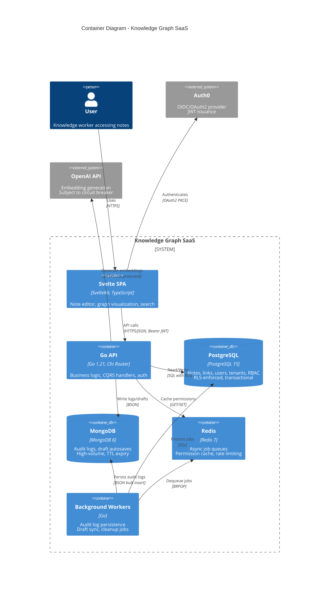
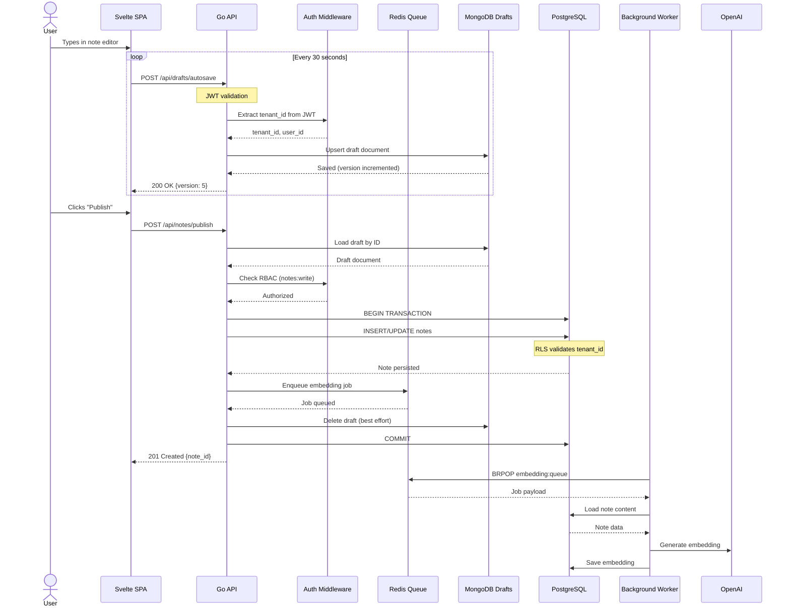
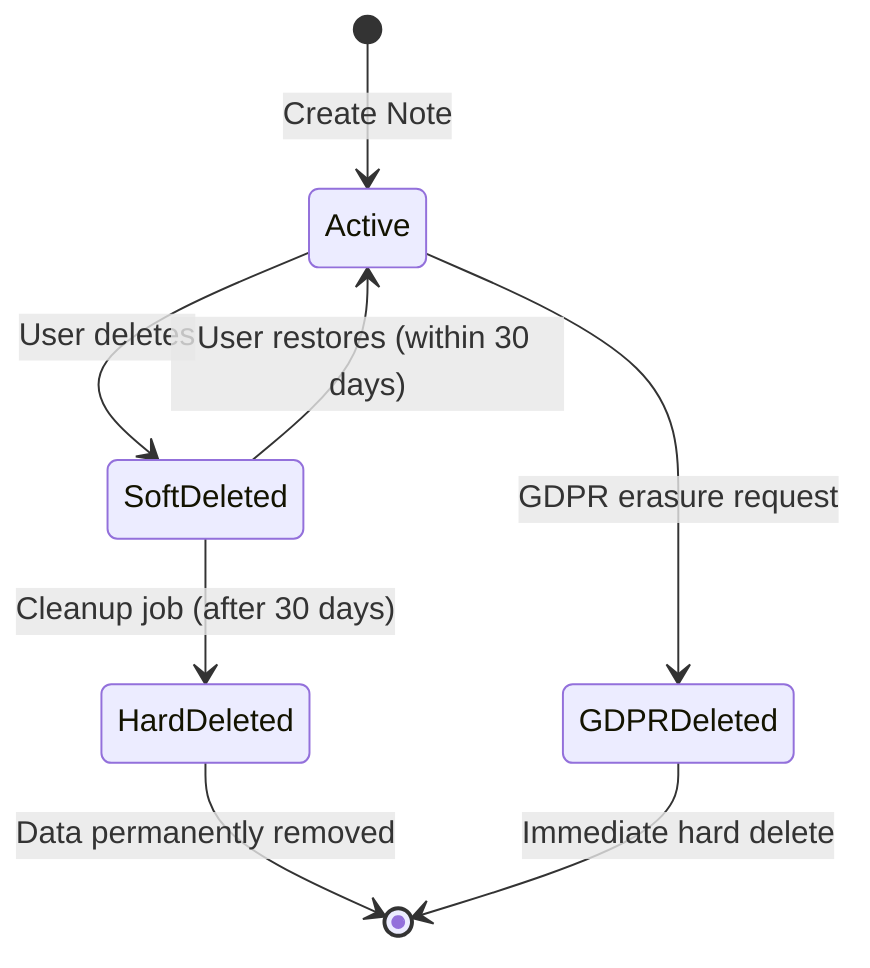
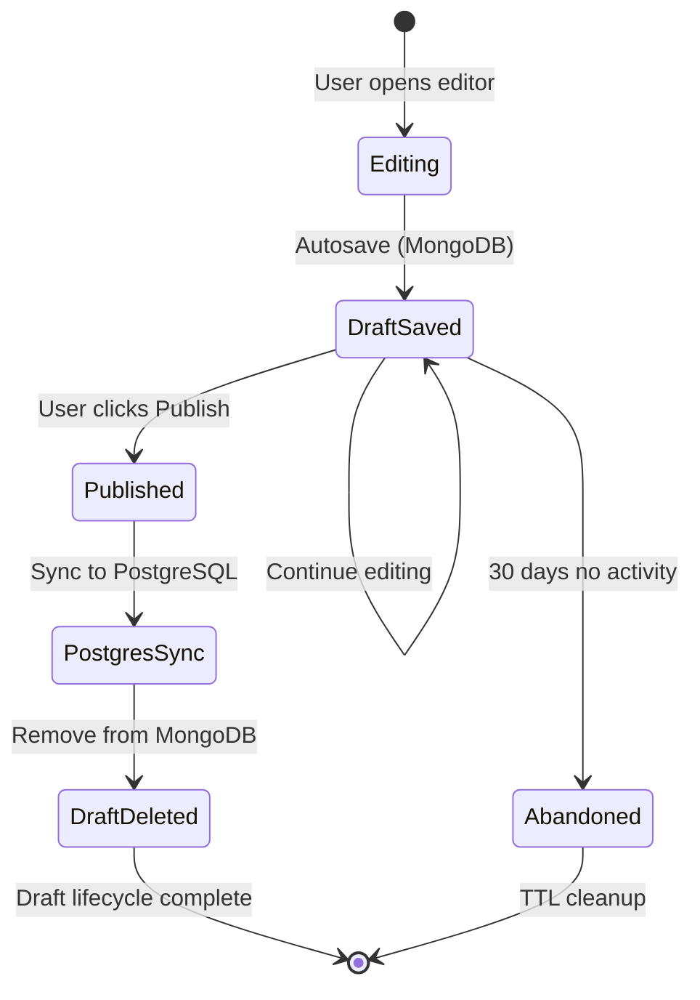

# Architecture Summary: Knowledge Graph SaaS

## Executive Summary

The Knowledge Graph platform is a **multi-tenant SaaS application** built on **Clean Architecture principles** with a **Go backend** and **Svelte frontend**. The architecture prioritizes:

1. **Data Isolation**: PostgreSQL Row-Level Security (RLS) enforces tenant boundaries at the database level
2. **Scalability**: CQRS-Lite pattern separates read/write concerns; Redis queues enable async processing
3. **Resilience**: Circuit breakers and fallback strategies prevent cascade failures
4. **Compliance**: Comprehensive audit logging with 90-day retention

### Key Architectural Decisions

| Decision | Rationale |
|----------|-----------|
| **Shared Database + RLS** | Accept RLS complexity to avoid DB-per-tenant operational overhead |
| **CQRS-Lite (Single DB)** | Optimize read/write paths without event sourcing complexity |
| **MongoDB for Logs/Drafts** | High-volume, write-heavy workloads isolated from transactional DB |
| **Rich Domain Model** | Business logic in entities, not anemic services |
| **Defense in Depth** | App-layer auth checks + RLS policies as last line |

## C4 Container Diagram



## Data Flow: User Saves Draft



## Technology Stack

| Layer | Technology | Purpose |
|-------|------------|---------|
| **Frontend** | SvelteKit + TypeScript | SPA with graph visualization |
| **API** | Go 1.21 + Chi | REST API, CQRS handlers |
| **Domain** | Pure Go structs | Rich entities, value objects |
| **Primary DB** | PostgreSQL 15 | Notes, links, users, tenants |
| **NoSQL** | MongoDB 6 | Audit logs, draft autosaves |
| **Cache/Queue** | Redis 7 | Job queues, permission cache |
| **Auth** | Auth0 (OIDC) | JWT issuance, MFA support |
| **Embeddings** | OpenAI API | Vector generation (CB protected) |
| **Circuit Breaker** | sony/gobreaker | Resilience patterns |

## Security Architecture

### Defense in Depth Layers

```
┌─────────────────────────────────────┐
│  Layer 4: PostgreSQL RLS          │
│  - Database enforces tenant_id      │
│  - FORCE RLS prevents bypass        │
├─────────────────────────────────────┤
│  Layer 3: Application RBAC          │
│  - JWT permission claims            │
│  - Role-based access control        │
│  - Resource ownership checks        │
├─────────────────────────────────────┤
│  Layer 2: Authentication            │
│  - Auth0 OIDC validates JWT         │
│  - Token expiration enforced          │
├─────────────────────────────────────┤
│  Layer 1: Transport Security        │
│  - TLS 1.3 for all connections        │
│  - CORS policy restrictions         │
└─────────────────────────────────────┘
```

### JWT Claims Structure

```json
{
  "sub": "user-uuid-123",
  "tenant_id": "tenant-uuid-456",
  "role": "member",
  "permissions": [
    "notes:read",
    "notes:write:own",
    "links:read"
  ],
  "iat": 1705312800,
  "exp": 1705399200
}
```

## Data Lifecycle

### Soft Delete Flow



### Draft Synchronization



## Performance Characteristics

| Operation | Latency Target | Implementation |
|-----------|----------------|----------------|
| Draft autosave | < 100ms | MongoDB direct write |
| Note publish | < 500ms | Postgres transaction |
| Query list | < 200ms | CQRS query handler + indexes |
| Permission check | < 10ms | JWT claims (no DB hit) |
| Embedding generation | < 2s | Async worker, not blocking |

## Operational Considerations

### Monitoring
- Circuit breaker state changes emit alerts
- Redis queue depth monitored for backlog
- MongoDB TTL expiry tracked for compliance
- RLS policy effectiveness via query plans

### Backup Strategy
- PostgreSQL: Daily snapshots + WAL archiving
- MongoDB: Daily snapshots (audit logs = 90 days only)
- Redis: RDB snapshots (queues = ephemeral)

### Scaling Vectors
- **Read scaling**: Read replicas for CQRS queries
- **Write scaling**: Shard by tenant_id for MongoDB
- **Worker scaling**: Horizontal pod autoscaler on queue depth

## References

- [ADR 001: Layered Architecture](./architecture/decisions/001-layered-architecture.md)
- [ADR 003: Multi-Tenancy Strategy](./architecture/decisions/003-multi-tenancy-strategy.md)
- [ADR 009: Resilience Patterns](./architecture/decisions/009-resilience-patterns.md)
- [SaaS Database Schema](./SaaS_DATABASE_SCHEMA.md)
