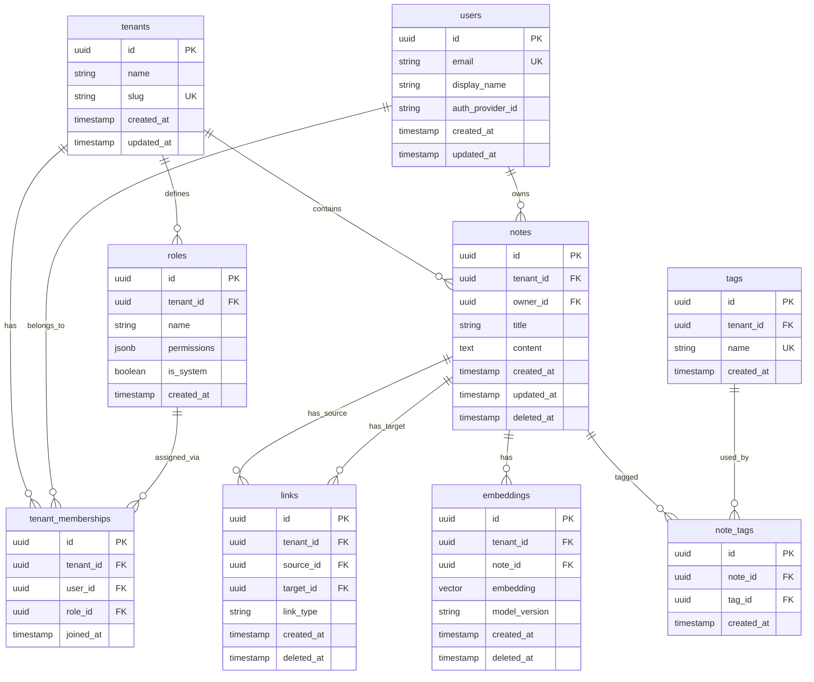

# SaaS Database Schema

## Overview

This document describes the complete database schema for the multi-tenant Knowledge Graph SaaS. The schema is designed around **PostgreSQL with Row-Level Security (RLS)** as the primary transactional store, with **MongoDB** handling high-volume append-only workloads (audit logs, drafts).

## Core Principles

1. **Every table has `tenant_id`**: All tenant-scoped tables include `tenant_id` column
2. **RLS policies enforce isolation**: Database-level defense even if application logic fails
3. **Soft delete pattern**: `deleted_at` timestamp for recoverable deletes
4. **JSONB for flexibility**: Role permissions use JSONB for schema evolution

## Entity Relationship Diagram



## PostgreSQL Tables

### tenants
Stores tenant (organization) information.

```sql
CREATE TABLE tenants (
    id UUID PRIMARY KEY DEFAULT gen_random_uuid(),
    name VARCHAR(255) NOT NULL,
    slug VARCHAR(50) UNIQUE NOT NULL,
    created_at TIMESTAMP NOT NULL DEFAULT NOW(),
    updated_at TIMESTAMP NOT NULL DEFAULT NOW()
);

CREATE INDEX idx_tenants_slug ON tenants(slug);

-- Trigger for updated_at
CREATE OR REPLACE FUNCTION update_updated_at_column()
RETURNS TRIGGER AS $$
BEGIN
    NEW.updated_at = NOW();
    RETURN NEW;
END;
$$ language 'plpgsql';

CREATE TRIGGER update_tenants_updated_at 
    BEFORE UPDATE ON tenants 
    FOR EACH ROW EXECUTE FUNCTION update_updated_at_column();
```

### users
User accounts (can belong to multiple tenants via memberships).

```sql
CREATE TABLE users (
    id UUID PRIMARY KEY DEFAULT gen_random_uuid(),
    email VARCHAR(255) UNIQUE NOT NULL,
    display_name VARCHAR(255),
    auth_provider_id VARCHAR(255),  -- Auth0 user ID
    created_at TIMESTAMP NOT NULL DEFAULT NOW(),
    updated_at TIMESTAMP NOT NULL DEFAULT NOW()
);

CREATE TRIGGER update_users_updated_at 
    BEFORE UPDATE ON users 
    FOR EACH ROW EXECUTE FUNCTION update_updated_at_column();
```

### roles
RBAC role definitions with JSONB permissions.

```sql
CREATE TABLE roles (
    id UUID PRIMARY KEY DEFAULT gen_random_uuid(),
    tenant_id UUID NOT NULL REFERENCES tenants(id) ON DELETE CASCADE,
    name VARCHAR(50) NOT NULL,
    permissions JSONB NOT NULL DEFAULT '[]',
    is_system BOOLEAN DEFAULT false,
    created_at TIMESTAMP NOT NULL DEFAULT NOW(),
    
    UNIQUE(tenant_id, name)
);

-- Index for permission queries
CREATE INDEX idx_roles_tenant ON roles(tenant_id);

-- GIN index for JSONB permissions (if querying by permission)
CREATE INDEX idx_roles_permissions ON roles USING GIN(permissions);
```

**System Roles (auto-created with each tenant):**
```sql
-- Owner: full access
INSERT INTO roles (tenant_id, name, permissions, is_system) 
SELECT id, 'owner', '["*"]', true FROM tenants;

-- Admin: manage members, notes
INSERT INTO roles (tenant_id, name, permissions, is_system) 
SELECT id, 'admin', '[
    "members:read", "members:write", "members:delete",
    "notes:*", "links:*", "settings:read", "settings:write"
]', true FROM tenants;

-- Member: create/edit own content
INSERT INTO roles (tenant_id, name, permissions, is_system) 
SELECT id, 'member', '[
    "notes:read", "notes:write:own", "notes:delete:own",
    "links:read", "links:write:own",
    "settings:read"
]', true FROM tenants;
```

### tenant_memberships
Links users to tenants with their assigned role.

```sql
CREATE TABLE tenant_memberships (
    id UUID PRIMARY KEY DEFAULT gen_random_uuid(),
    tenant_id UUID NOT NULL REFERENCES tenants(id) ON DELETE CASCADE,
    user_id UUID NOT NULL REFERENCES users(id) ON DELETE CASCADE,
    role_id UUID NOT NULL REFERENCES roles(id),
    joined_at TIMESTAMP NOT NULL DEFAULT NOW(),
    
    UNIQUE(tenant_id, user_id)
);

CREATE INDEX idx_memberships_tenant ON tenant_memberships(tenant_id);
CREATE INDEX idx_memberships_user ON tenant_memberships(user_id);
CREATE INDEX idx_memberships_role ON tenant_memberships(role_id);
```

### notes
Core content entity with soft delete.

```sql
CREATE TABLE notes (
    id UUID PRIMARY KEY DEFAULT gen_random_uuid(),
    tenant_id UUID NOT NULL REFERENCES tenants(id) ON DELETE CASCADE,
    owner_id UUID NOT NULL REFERENCES users(id),
    title VARCHAR(255) NOT NULL,
    content TEXT,
    created_at TIMESTAMP NOT NULL DEFAULT NOW(),
    updated_at TIMESTAMP NOT NULL DEFAULT NOW(),
    deleted_at TIMESTAMP,  -- NULL = active, NOT NULL = soft-deleted
    
    CONSTRAINT chk_title_not_empty CHECK (LENGTH(TRIM(title)) > 0)
);

-- Indexes for RLS performance
CREATE INDEX idx_notes_tenant ON notes(tenant_id);
CREATE INDEX idx_notes_tenant_deleted ON notes(tenant_id, deleted_at) 
    WHERE deleted_at IS NULL;
CREATE INDEX idx_notes_owner ON notes(owner_id);
CREATE INDEX idx_notes_updated ON notes(updated_at DESC);

-- Full-text search
CREATE INDEX idx_notes_fts ON notes 
    USING GIN(to_tsvector('english', title || ' ' || COALESCE(content, '')));

CREATE TRIGGER update_notes_updated_at 
    BEFORE UPDATE ON notes 
    FOR EACH ROW EXECUTE FUNCTION update_updated_at_column();
```

### links
Graph edges connecting notes (many-to-many self-referential).

```sql
CREATE TABLE links (
    id UUID PRIMARY KEY DEFAULT gen_random_uuid(),
    tenant_id UUID NOT NULL REFERENCES tenants(id) ON DELETE CASCADE,
    source_id UUID NOT NULL REFERENCES notes(id) ON DELETE CASCADE,
    target_id UUID NOT NULL REFERENCES notes(id) ON DELETE CASCADE,
    link_type VARCHAR(50) NOT NULL DEFAULT 'related',
    created_at TIMESTAMP NOT NULL DEFAULT NOW(),
    deleted_at TIMESTAMP,
    
    -- Prevent self-links
    CONSTRAINT chk_no_self_link CHECK (source_id != target_id),
    -- Prevent duplicate links
    UNIQUE(tenant_id, source_id, target_id, link_type)
);

CREATE INDEX idx_links_tenant ON links(tenant_id);
CREATE INDEX idx_links_tenant_deleted ON links(tenant_id, deleted_at) 
    WHERE deleted_at IS NULL;
CREATE INDEX idx_links_source ON links(source_id);
CREATE INDEX idx_links_target ON links(target_id);
```

### embeddings
Vector embeddings for semantic search.

```sql
CREATE TABLE embeddings (
    id UUID PRIMARY KEY DEFAULT gen_random_uuid(),
    tenant_id UUID NOT NULL REFERENCES tenants(id) ON DELETE CASCADE,
    note_id UUID NOT NULL REFERENCES notes(id) ON DELETE CASCADE,
    embedding vector(1536),  -- OpenAI ada-002 dimension
    model_version VARCHAR(50) NOT NULL DEFAULT 'text-embedding-ada-002',
    created_at TIMESTAMP NOT NULL DEFAULT NOW(),
    deleted_at TIMESTAMP,
    
    UNIQUE(tenant_id, note_id)
);

CREATE INDEX idx_embeddings_tenant ON embeddings(tenant_id);
CREATE INDEX idx_embeddings_note ON embeddings(note_id);

-- HNSW index for vector similarity search (pgvector extension)
CREATE INDEX idx_embeddings_vector ON embeddings 
    USING hnsw (embedding vector_cosine_ops);
```

### tags
Tenant-scoped tag definitions.

```sql
CREATE TABLE tags (
    id UUID PRIMARY KEY DEFAULT gen_random_uuid(),
    tenant_id UUID NOT NULL REFERENCES tenants(id) ON DELETE CASCADE,
    name VARCHAR(50) NOT NULL,
    created_at TIMESTAMP NOT NULL DEFAULT NOW(),
    
    UNIQUE(tenant_id, name)
);

CREATE INDEX idx_tags_tenant ON tags(tenant_id);
```

### note_tags
Many-to-many join table.

```sql
CREATE TABLE note_tags (
    id UUID PRIMARY KEY DEFAULT gen_random_uuid(),
    note_id UUID NOT NULL REFERENCES notes(id) ON DELETE CASCADE,
    tag_id UUID NOT NULL REFERENCES tags(id) ON DELETE CASCADE,
    created_at TIMESTAMP NOT NULL DEFAULT NOW(),
    
    UNIQUE(note_id, tag_id)
);

CREATE INDEX idx_note_tags_note ON note_tags(note_id);
CREATE INDEX idx_note_tags_tag ON note_tags(tag_id);
```

## Row-Level Security (RLS)

### Enable RLS on All Tables
```sql
-- Enable RLS
ALTER TABLE notes ENABLE ROW LEVEL SECURITY;
ALTER TABLE links ENABLE ROW LEVEL SECURITY;
ALTER TABLE embeddings ENABLE ROW LEVEL SECURITY;
ALTER TABLE tenant_memberships ENABLE ROW LEVEL SECURITY;
ALTER TABLE roles ENABLE ROW LEVEL SECURITY;
ALTER TABLE tags ENABLE ROW LEVEL SECURITY;
ALTER TABLE note_tags ENABLE ROW LEVEL SECURITY;

-- Force RLS even for table owner (defense in depth)
ALTER TABLE notes FORCE ROW LEVEL SECURITY;
ALTER TABLE links FORCE ROW LEVEL SECURITY;
ALTER TABLE embeddings FORCE ROW LEVEL SECURITY;
ALTER TABLE tenant_memberships FORCE ROW LEVEL SECURITY;
ALTER TABLE roles FORCE ROW LEVEL SECURITY;
ALTER TABLE tags FORCE ROW LEVEL SECURITY;
ALTER TABLE note_tags FORCE ROW LEVEL SECURITY;
```

### Helper Function
```sql
-- Helper to set tenant context
CREATE OR REPLACE FUNCTION set_tenant_context(tenant_id UUID)
RETURNS void AS $$
BEGIN
    PERFORM set_config('app.current_tenant_id', tenant_id::text, false);
END;
$$ LANGUAGE plpgsql;
```

### RLS Policies
```sql
-- Notes: Users can only access their tenant's non-deleted notes
CREATE POLICY tenant_isolation_notes ON notes
    FOR ALL
    USING (
        tenant_id = current_setting('app.current_tenant_id')::UUID
        AND deleted_at IS NULL
    );

-- Links: Same tenant restriction
CREATE POLICY tenant_isolation_links ON links
    FOR ALL
    USING (
        tenant_id = current_setting('app.current_tenant_id')::UUID
        AND deleted_at IS NULL
    );

-- Embeddings: Same tenant restriction
CREATE POLICY tenant_isolation_embeddings ON embeddings
    FOR ALL
    USING (
        tenant_id = current_setting('app.current_tenant_id')::UUID
        AND deleted_at IS NULL
    );

-- Tenant Memberships: Users see only their memberships in current tenant
CREATE POLICY tenant_isolation_memberships ON tenant_memberships
    FOR ALL
    USING (
        tenant_id = current_setting('app.current_tenant_id')::UUID
    );

-- Roles: Only roles from current tenant
CREATE POLICY tenant_isolation_roles ON roles
    FOR ALL
    USING (
        tenant_id = current_setting('app.current_tenant_id')::UUID
    );

-- Tags: Only tags from current tenant
CREATE POLICY tenant_isolation_tags ON tags
    FOR ALL
    USING (
        tenant_id = current_setting('app.current_tenant_id')::UUID
    );

-- Note Tags: Access through note (implicit tenant check via note)
CREATE POLICY tenant_isolation_note_tags ON note_tags
    FOR ALL
    USING (
        note_id IN (
            SELECT id FROM notes 
            WHERE tenant_id = current_setting('app.current_tenant_id')::UUID
        )
    );
```

## MongoDB Collections

### audit_logs
High-volume audit trail with TTL expiration.

```javascript
// Collection schema (document-based)
{
  "_id": ObjectId("..."),
  "timestamp": ISODate("2024-01-15T10:30:00Z"),
  "tenant_id": BinData(4, "..."),  // UUID
  "user_id": BinData(4, "..."),
  "action": "note:create",
  "resource": {
    "type": "note",
    "id": BinData(4, "...")
  },
  "http": {
    "method": "POST",
    "path": "/api/v1/notes",
    "status_code": 201,
    "duration_ms": 145,
    "ip_address": "192.168.1.100",
    "user_agent": "Mozilla/5.0..."
  },
  "metadata": {
    // Flexible schema - varies by action
  }
}

// Indexes
db.audit_logs.createIndex({ "timestamp": 1 }, { expireAfterSeconds: 7776000 });  // 90 days
db.audit_logs.createIndex({ "tenant_id": 1, "timestamp": -1 });
db.audit_logs.createIndex({ "user_id": 1, "timestamp": -1 });
db.audit_logs.createIndex({ "action": 1, "timestamp": -1 });
```

### drafts
Autosave drafts with shorter TTL.

```javascript
// Collection schema
{
  "_id": ObjectId("..."),
  "note_id": BinData(4, "..."),  // NULL for new notes
  "user_id": BinData(4, "..."),
  "tenant_id": BinData(4, "..."),
  "title": "Draft Title",
  "content": "Draft content...",
  "version": 5,
  "created_at": ISODate("2024-01-15T09:00:00Z"),
  "last_saved_at": ISODate("2024-01-15T09:45:00Z"),
  "session_id": "uuid-session-123"
}

// Indexes
db.drafts.createIndex({ "last_saved_at": 1 }, { expireAfterSeconds: 2592000 });  // 30 days
db.drafts.createIndex({ "user_id": 1, "last_saved_at": -1 });
db.drafts.createIndex({ "note_id": 1, "user_id": 1 });
```

## Data Flow Examples

### Creating a Note
```sql
-- Application sets RLS context
SELECT set_tenant_context('550e8400-e29b-41d4-a716-446655440000');

-- Insert note (RLS policy validates tenant_id)
INSERT INTO notes (id, tenant_id, owner_id, title, content)
VALUES (gen_random_uuid(), '550e8400-e29b-41d4-a716-446655440000', 
        '6ba7b810-9dad-11d1-80b4-00c04fd430c8', 'My Note', 'Content');

-- Query notes (RLS automatically filters)
SELECT * FROM notes;  -- Only returns notes for current tenant
```

### Soft Delete
```sql
-- Soft delete (RLS ensures only tenant's data affected)
UPDATE notes 
SET deleted_at = NOW() 
WHERE id = 'note-uuid' 
  AND tenant_id = current_setting('app.current_tenant_id')::UUID;

-- Note still exists but hidden by RLS policy
SELECT * FROM notes WHERE id = 'note-uuid';  -- Returns 0 rows

-- Admin can view deleted (with elevated privileges)
SELECT * FROM notes WHERE deleted_at IS NOT NULL;
```

## Performance Considerations

1. **Always index `tenant_id`**: Critical for RLS performance
2. **Partial indexes on `deleted_at IS NULL`**: Exclude soft-deleted from active queries
3. **Connection pooling**: Reset `app.current_tenant_id` between requests
4. **EXPLAIN ANALYZE**: Verify RLS policies use indexes, not seq scans

## Migration Notes

See [ADR 008: Data Migration Plan](./architecture/decisions/008-data-migration-plan.md) for:
- Adding `tenant_id` to existing tables
- Backfilling with default tenant
- Enabling RLS policies
- Rollback procedures

## References

- [ADR 003: Multi-Tenancy Strategy](./architecture/decisions/003-multi-tenancy-strategy.md)
- [ADR 004: Soft Delete Strategy](./architecture/decisions/004-soft-delete-strategy.md)
- [ADR 006: RBAC System](./architecture/decisions/006-rbac-system.md)
- [ADR 010: Audit Log Storage](./architecture/decisions/010-audit-log-storage-mongodb.md)
- [ADR 011: Drafts Autosave](./architecture/decisions/011-drafts-autosave-mongodb.md)
