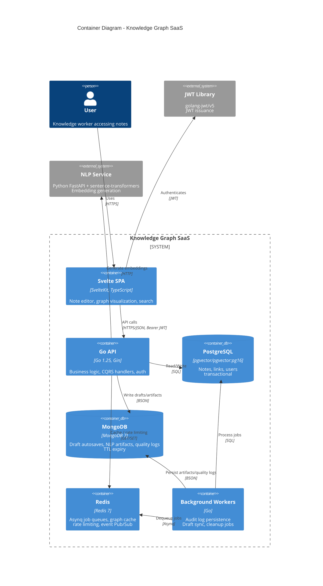
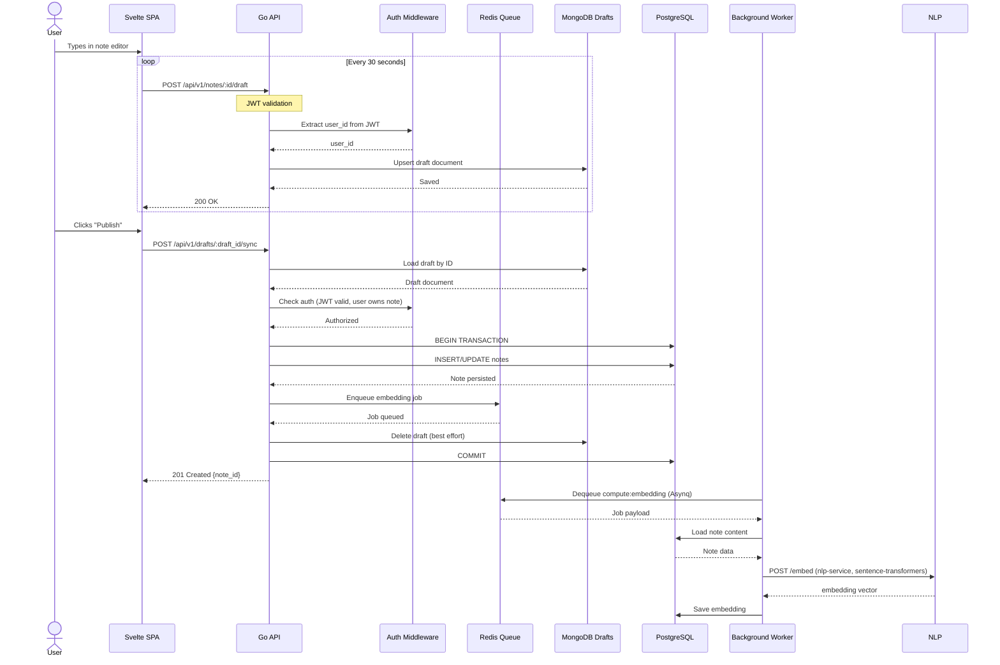
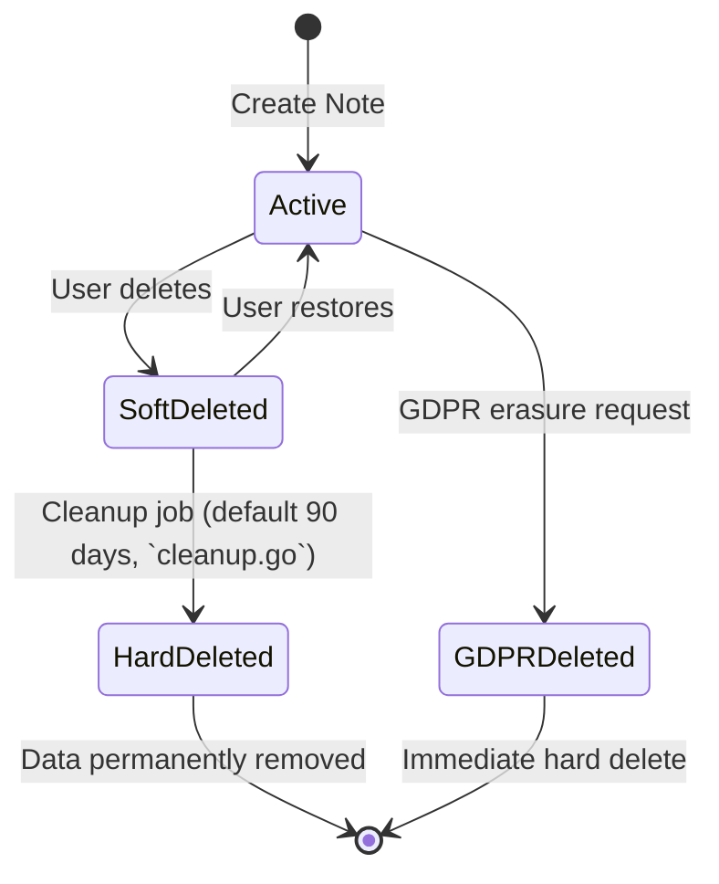
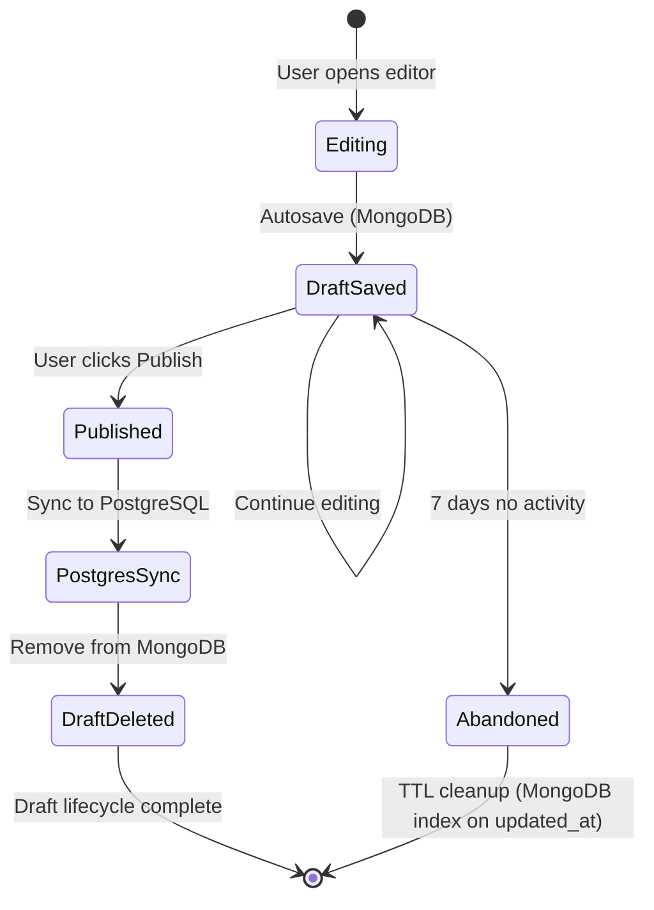

# Architecture Summary: Knowledge Graph SaaS

> **Scope note (DOC-AUDIT-2, 2026-09-26):** this document describes the **target SaaS**
> architecture. Not implemented in current code: PostgreSQL RLS and `tenant_id`
> (no tenant concept — release 1.0 is single-user, decision 67), permission claims
> in JWT (tokens carry `user_id`/`login`/`role` only), circuit breakers
> (`sony/gobreaker` is not a dependency), TLS termination (dev stack is plain HTTP,
> `sslmode=disable`), MongoDB TTL audit retention job. Items awaiting owner's
> decision are listed in `docs/tasks/DOC-AUDIT-2-register.md`.

## Executive Summary

The Knowledge Graph platform is a **multi-tenant SaaS application** built on **Clean Architecture principles** with a **Go backend** and **Svelte frontend**. The architecture prioritizes:

1. **Data Isolation**: PostgreSQL Row-Level Security (RLS) is designed to enforce tenant boundaries *(not implemented — see scope note)*
2. **Scalability**: CQRS-Lite pattern separates read/write concerns; Redis (Asynq) queues enable async processing
3. **Resilience**: Circuit breakers and fallback strategies *(planned; `sony/gobreaker` is not a dependency — DOC-AUDIT-2)*
4. **Compliance**: Audit logging is partially in place — the `audit_log` table and `AuditLogModel` exist, but no code path writes to it (DOC-AUDIT-2, 2026-09-26); the "90-day retention" job is not implemented

### Key Architectural Decisions

| Decision | Rationale |
|----------|-----------|
| **Shared Database + RLS** | Accept RLS complexity to avoid DB-per-tenant operational overhead *(RLS not implemented — single-user scope, decision 67)* |
| **CQRS-Lite (Single DB)** | Optimize read/write paths without event sourcing complexity |
| **MongoDB for Drafts/Artifacts** | Write-heavy derived data isolated from transactional DB |
| **Rich Domain Model** | Business logic in entities, not anemic services |
| **Defense in Depth** | App-layer auth checks (RLS policies as last line — not implemented) |

## C4 Container Diagram



## Data Flow: User Saves Draft



## Technology Stack

| Layer | Technology | Purpose |
|-------|------------|---------|
| **Frontend** | SvelteKit + TypeScript | SPA with graph visualization |
| **API** | Go 1.25 + Gin | REST API, CQRS handlers |
| **Domain** | Pure Go structs | Rich entities, value objects |
| **Primary DB** | pgvector/pgvector:pg16 | Notes, links, users |
| **NoSQL** | MongoDB 7 | Draft autosaves, NLP artifacts, quality logs |
| **Cache/Queue** | Redis 7 | Asynq job queues, graph cache, rate limiting |
| **Auth** | golang-jwt/v5 | JWT issuance, signing, validation |
| **Embeddings** | NLP Service (Python FastAPI + sentence-transformers) | Vector generation |

## Security Architecture

### Defense in Depth Layers

```
┌─────────────────────────────────────┐
│  Layer 4: PostgreSQL RLS          │
│  - target SaaS, NOT IMPLEMENTED     │
│    (DOC-AUDIT-2, 2026-09-26)        │
├─────────────────────────────────────┤
│  Layer 3: Authorization             │
│  - JWT role claim (admin/member)    │
│  - Resource ownership checks        │
├─────────────────────────────────────┤
│  Layer 2: Authentication            │
│  - golang-jwt validates JWT         │
│  - Token expiration enforced          │
├─────────────────────────────────────┤
│  Layer 1: Transport Security        │
│  - CORS policy restrictions         │
│  - TLS termination: not configured  │
│    in dev/personal stacks           │
└─────────────────────────────────────┘
```

### JWT Claims Structure

```json
{
  "sub": "user-uuid-123",
  "iss": "knowledge-graph",
  "user_id": "user-uuid-123",
  "login": "user",
  "role": "member",
  "token_type": "access",
  "jti": "token-uuid",
  "iat": 1705312800,
  "nbf": 1705312800,
  "exp": 1705399200
}
```

(`backend/internal/auth/jwt.go` — `TokenClaims`: `UserID`, `Login`, `Role`, `TokenType` plus
registered claims. No `tenant_id` or `permissions` array — target-SaaS fields.)

## Data Lifecycle

### Soft Delete Flow



As implemented (NOTE-DELETE-1): `NoteModel.DeletedAt` is `gorm.DeletedAt`, so all
GORM note queries auto-filter trashed rows; raw SQL paths (`note_embeddings`,
`note_keywords`, tag joins, similarity candidates) filter `deleted_at IS NULL`
explicitly. `Delete`/`DeleteBatch` run one transaction that soft-deletes the
note and its still-live links, stamping `links.deleted_via_note_id` so
`Restore` revives exactly the links that went down with the note — and only
once both endpoints are alive again. A link removed on its own is a hard
delete and never resurfaces. The worker schedules `cleanup:soft_deleted`
daily; `PurgeDeletedBefore` hard-deletes notes past the 90-day horizon and
their links through the FK cascade. Deletion publishes `NoteDeleted`,
restoration `NoteUpdated`, so graph-service refreshes `note_links_closure`
through the regular event flow.

### Draft Synchronization



## Performance Characteristics

| Operation | Latency Target | Implementation |
|-----------|----------------|----------------|
| Draft autosave | < 100ms | MongoDB direct write |
| Note publish | < 500ms | Postgres transaction |
| Query list | < 200ms | CQRS query handler + indexes |
| Permission check | < 10ms | JWT claims (no DB hit) |
| Embedding generation | < 2s | Async worker, not blocking |

## Automatic (Gamma) Links

- After a `compute:embedding` task stores a note's embedding, the worker runs `GammaLinkGenerator` (`internal/application/recommendation`): up to `maxOutDegree = 2` nearest neighbours above `GAMMA_LINK_MIN_SCORE` (default `0.6`, env → `knowledge-graph.config.json` → `config.go`) become `links` rows with `source_type = 'gamma'`, `link_type = 'related'`, weight = cosine score.
- Self-links and targets already linked (manually or by gamma) are skipped, so the pass is idempotent; manual links are never modified.
- **Three states of a pair** (LINKS-2): a gamma proposal can be confirmed by a manual `POST /links` on the same pair — the existing row is promoted to `source_type='user'` (HTTP 200, same id and `created_at`) and keeps its origin in `metadata.gamma = {"score": <proposed weight>, "generated_at": <row created_at>}`. Deleting a gamma link — or a promoted one — writes a rejection into `link_suppressions` (normalized pair, `link_type` NULL = "no link at all"); the generator skips rejected pairs in both directions, and a manual link on a rejected pair lifts the rejection in the same transaction. Note deletion cascades its rejections.
- Each created link produces a `LinkCreated` event on the graph channel — graph-service invalidates caches and schedules a debounced async refresh of `note_links_closure` (one REFRESH per burst of events) — and a refresh-recommendations task is enqueued for the source and each target.
- The out-degree cap exists because every edge adds reachable pairs to `note_links_closure`. Migration 033 bounds the view: BFS levels deduped per `(ancestor, descendant, distance)` up to depth 5 (the consumers' max), weight = max product over shortest paths; the stored `path` column was dropped — the path between two notes is computed on demand (`GetShortestPath`).
- Threshold `0.6` and degree `2` are the cautious start of the W-1-recommended range (0.55–0.6 cosine, degree 2–3) — derived from the autolink precision curve on the `folder_path` ground truth, see `docs/tasks/W-1-eval-findings.md`. Recalibration on a real corpus is part of MODEL-1 follow-up.
- Regeneration after a model change: `go run ./cmd/gamma-links-regenerate --dry-run` reports how many gamma links would be deleted and created and how many candidates were discarded by recorded rejections; without the flag it deletes only `source_type='gamma'` rows and regenerates for notes that have an embedding for the current model.

## NLP Embedding Pipeline (CHUNK-1)

- `nlp-service/app/core/chunking.py` is a pure module (no FastAPI/model/I/O):
  `chunk(text, params) -> list[Chunk]` splits structure-first (headings, code
  fences, tables — atomic while they fit), then sentences, then clauses
  (`;:,`), with a hard `max_tokens` invariant and `forced_split` marking.
  Each chunk carries `idx`, `text`, `heading_path`, `char_span` (exact source
  offsets), `token_count`, `kind`. `aggregate(vectors)` = mean + L2 normalize.
- Feature flag `EMBED_CHUNKING` (env, default `0`, wired in all compose files):
  - `off` — `/embed` and the keyword `_doc_vector` behave exactly as before;
    the worker sends `content`/`title` as separate fields and the service
    recombines them into the legacy `title + " " + content` string.
  - `on` — `/embed` chunks the text, runs one batched `encode`, averages +
    L2-normalizes, and adds `chunks`/`no_content` to the response; the note
    title is injected into every chunk's model input; heading-link stubs
    (`## [title](url)`) produce zero chunks and embed the title only.
    `_doc_vector` uses the same structural chunker under the flag.
- **Conditional completeness:** the flag stays off until MODEL-2 activates it
  together with the new model and normalized vectors (one recompute), and
  corpus measurements must be re-run after NOTE-QUALITY-1 changes the input
  corpus — see `docs/tasks/CHUNK-1-structure-aware-chunker.md`.

## NLP Normalization Pipeline (NLP-4)

- `nlp-service/app/core/normalization.py` is a pure module (no FastAPI/model/
  I/O): `normalize(text, params)` runs **one deterministic pass** over a
  ruleset ported from `scripts/measure_normalization.py` — boilerplate lines
  (cookies, subscribe, share, footer, read-more), bare URL lines, navigation
  runs (>=3 consecutive short unpunctuated lines), near-duplicate lines,
  whitespace collapse. Inputs shorter than `min_chars` (100) pass through
  untouched (`skipped=True`).
- Two safety guards roll the result back to the source text: length
  (`len(result) < min_chars` -> `too_short`) and cosine similarity
  (`cos(emb(result), emb(source)) < min_cosine` -> `low_cosine`). The embed
  function is injected, so the guard is unit-testable without a model.
- `POST /normalize` (nlp-service) accepts `{text, title}` and returns
  `normalized_text`, `chunks` (CHUNK-1 chunker), `metrics` (raw/norm tokens,
  compression, iterations=1, `emb_cosine`, `stop_reason`), `rolled_back`,
  `rollback_reason`, `skipped`, `pipeline_version="norm-v1"`. The endpoint is
  stateless — persistence is the backend worker's job.
- MongoDB collection `nlp_artifacts` stores the derived form:
  `{note_id, source_hash (sha256 title+content), pipeline_version,
  model_version, normalized_text, chunks[], metrics, rolled_back,
  rollback_reason, status: current|superseded, created_at}`. Index
  `(note_id, pipeline_version, status)` with a partial unique index on
  `current`; `(note_id)` index serves the deletion cascade.
- Worker task `nlp:normalize`: fetch note -> compute source hash -> skip
  when the current artifact already matches -> call `/normalize` ->
  `SaveCurrent` (supersedes the previous current document when
  `nlp.history.enabled`, deletes it otherwise). Deleting a note enqueues
  `nlp:artifacts_cleanup`, which removes all of its artifact documents.
- `notes.content` is sacred: the pipeline never writes back — the artifact
  is a derived projection. Embeddings still use raw `notes.content`;
  switching vectors to the normalized form is deferred to MODEL-2.
- Switches: `nlp.pipeline.enabled` (JSON `nlp.pipeline.enabled` / env
  `NLP_PIPELINE_ENABLED`, default off — no task is enqueued and `/normalize`
  is never called), `nlp.history.enabled` (default on),
  `nlp.normalization.min_cosine` (default 0.7, e5-base scale, recalibrated
  in MODEL-2). Backfill: `go run ./cmd/nlp-artifacts-recompute --dry-run`
  prints create/skip counts; without the flag it enqueues `nlp:normalize`
  for notes with missing or stale artifacts regardless of the pipeline flag
  (explicit operator action).
- **Conditional completeness:** same caveat as CHUNK-1 — the artifacts are
  written but unused until MODEL-2 routes embedding inputs through them,
  and measurements must be re-run after NOTE-QUALITY-1 changes the corpus.
  See `docs/tasks/NLP-4-note-logical-form-normalization.md`.

## Note Quality Pipeline (NOTE-QUALITY-1, stage 1)

- `quality:assess` is enqueued after `nlp:normalize` and after each note
  enrichment task (keywords, embedding, link updates). Manual assessments
  come from `POST /api/v1/notes/{id}/quality/assess` or from
  `quality-recompute`.
- The assessor (`internal/application/quality`) computes deterministic
  signals over the normalized artifact text (raw content when no artifact
  matches the current `source_hash`): volume (`words`, `prose_words`),
  completeness (`ends_with_sentence`, `truncated_by_import`,
  `unclosed_fence`), structure (`headings`, `fragment_share`,
  `max_block_words`), presence of thought (`sentences`, `prose_share`,
  `kind` = stub/collection/text), readiness counters (keywords, links,
  embedding), and `mojibake`. Model-dependent signals (`coherence_min/median`,
  `title_text_similarity`) come through the embedder port and stay `null`
  when the model is unavailable.
- Four weight-free gates produce `verdict ∈ {create, enrich, manual}`:
  `stub` → enrich, `truncated` → enrich, `empty` (no text, no source) →
  manual, `mojibake` → manual. Stage 1 never blocks or mutates the note —
  the record is an indicator only.
- Stop rule per text version (`source_hash`): identical signals suppress a
  new entry; automatic passes are capped at 3, a gate that still holds
  after the third marks `needs_manual_review`. Manual triggers always
  write.
- Storage: the current `nlp_artifacts` document gets a `quality` field
  (`signals, gates, verdict, reasons, attempt, computed_at`,
  `pipeline_version: "quality-v1"`); every assessment is also appended to
  MongoDB `quality_log` (last 10 per note).
- `GET /api/v1/notes/{id}/quality` returns the latest record and the log;
  note authorization applies. Switch `nlp.quality.enabled` (env
  `NLP_QUALITY_ENABLED`, default off): no task is enqueued and the API
  answers `{"enabled": false}`.
- Refetch (user action only, never from the pipeline): preview → apply →
  restore. Apply stores the previous body in `metadata.previous_content`;
  restore puts it back byte-exactly.
- Backfill: `go run ./cmd/quality-recompute --dry-run` prints due/assessed
  counts; `--export <file.jsonl>` dumps ids + hashes + signals with no
  note text (output goes to `work-quality/local/`, gitignored). A real run
  enqueues manual `quality:assess` tasks — the client gate still honours
  `nlp.quality.enabled`.
- See `docs/tasks/NOTE-QUALITY-1-quality-loop.md` for the stage-1 spec.

## Operational Considerations

### Monitoring
- ~~Circuit breaker state changes emit alerts~~ *(circuit breakers not implemented — scope note)*
- Redis queue depth monitored for backlog *(asynqmon/manual redis-cli — see RECOMMENDATION_TROUBLESHOOTING.md; no automated alerting exists)*
- MongoDB TTL expiry tracked for compliance *(TTL index exists on `drafts`; no dedicated monitoring job)*
- ~~RLS policy effectiveness via query plans~~ *(RLS not implemented — scope note)*

### Backup Strategy
- PostgreSQL (personal stack): `backup_scheduler` runs `pg_dump` daily + weekly via cron (retention 7/90 days, optional Yandex.Disk upload — `scripts/devops/backup-personal.*`); **no WAL archiving**
- MongoDB: **no backup** — drafts/artifacts are regenerable
- Redis: **no backup** — queues/cache are ephemeral

### Scaling Vectors
- **Read scaling**: Read replicas for CQRS queries
- **Write scaling**: Shard by tenant_id for MongoDB
- **Worker scaling**: Horizontal pod autoscaler on queue depth

## References

- [ADR 001: Layered Architecture](./decisions/001-layered-architecture.md)
- [ADR 003: Multi-Tenancy Strategy](./decisions/003-multi-tenancy-strategy.md)
- [ADR 009: Resilience Patterns](./decisions/009-resilience-patterns.md)
- [SaaS Database Schema](./SaaS_DATABASE_SCHEMA.md)
