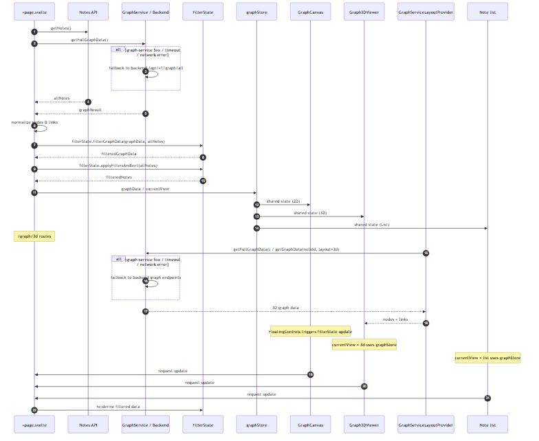
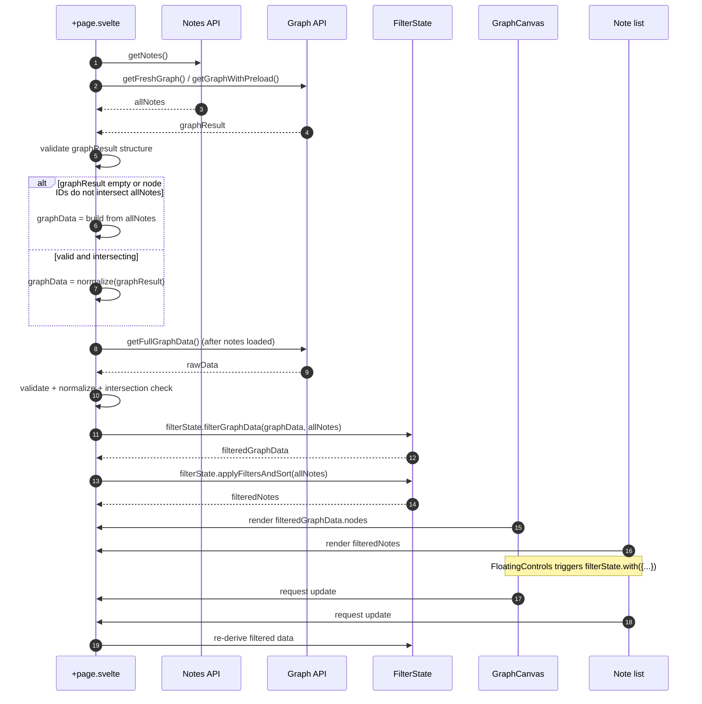

# Frontend Architecture Documentation

## Overview

The Knowledge Graph frontend is a **note-centric Svelte 5 application** with graph visualization as a secondary view. The architecture supports both 2D (D3-force + Canvas, default) and 3D (Three.js, `features/graph-3d`) visualization modes with progressive rendering (fog + batched node reveal).

### Key Features
- **Progressive Graph Loading**: graphs reveal nodes incrementally — fog-of-war in 3D (`features/graph-3d/lib/fog.ts`), batched reveal in 2D (`entities/graph-canvas/lib/incremental.ts`)
- **Three.js Modular Architecture**: `features/graph-3d/lib/` (scene, simulation, camera, fog, nodes, links, labels, engine)
- **Device-Adaptive**: `SmartGraph.svelte` chooses 2D vs 3D from device/WebGL capabilities
- **SSR-Safe**: All browser APIs properly guarded for server-side rendering

## Core Principles

1. **Graph-First Design**: The graph is the primary interface, not a separate page
2. **SSR-Safe**: All browser APIs are properly guarded to prevent server-side errors
3. **Progressive Enhancement**: 2D works everywhere, 3D is optional
4. **Accessibility**: Keyboard navigation, screen reader support, high contrast modes

## Technology Stack

- **Framework**: Svelte 5 (Runes mode)
- **Language**: TypeScript
- **Styling**: CSS with CSS variables for theming
- **Visualization**:
  - **3D (Primary)**: Three.js + d3-force-3d physics
  - **2D (Fallback)**: D3-force + Canvas API
- **Testing**: Playwright + Cucumber (BDD)
- **Build**: Vite

## Three.js Module Architecture

The 3D graph visualization is organized in modular layers under `frontend/src/`:

```
features/graph-3d/
├── lib/          # engine, scene, simulation, camera, fog, nodes, links, labels
├── model/        # layout-provider (server layout / delta integration)
├── ui/           # Graph3DScene.svelte
└── config.ts     # quality presets, fog configs
widgets/graph-3d-viewer/Graph3DViewer.svelte   # embeddable viewer widget
```

### Progressive Rendering (Fog of War)

**Concept**: Nodes gradually appear from "fog" with camera animation (3D); in 2D — batched reveal of the live simulation.

Real entry points today:

- 3D: `features/graph-3d/lib/scene.ts` (fog presets via `applyFogPreset`), `lib/simulation.ts`, `lib/camera.ts`, `lib/fog.ts`
- 2D: `entities/graph-canvas/lib/incremental.ts` — `addNodesToSimulation()` re-heats the live layout (`alpha(0.4).restart()`), see UI-LOAD-1 section below

## Architecture Diagram

```
┌─────────────────────────────────────────────────────────────────┐
│  App Shell (/*) - All Pages                                      │
│  ┌─────────┬──────────────────────────────────────────────────┐  │
│  │ (no     │              Main Content Area                    │  │
│  │ sidebar │                                                  │  │
│  │ in v1.0 │  ┌───────────────────────────────────────────┐  │  │
│  │ — CCC   │  │           Main Page (/)                    │  │  │
│  │ planned)│  │                                            │  │  │
│  │         │  │  ┌─────────────────────────────────────┐   │  │  │
│  │         │  │  │      NoteListView (Primary)         │   │  │  │
│  │         │  │  │   Grid of note cards with search    │   │  │  │
│  │         │  │  └─────────────────────────────────────┘   │  │  │
│  │         │  │         │                                   │  │  │
│  │         │  │    ┌─────────────┐   ┌───────────────┐    │  │  │
│  │         │  │    │FloatingAuth │   │ CockpitNote   │    │  │  │
│  │         │  │    │Panel        │   │ Details       │    │  │  │
│  │         │  │    └─────────────┘   └───────────────┘    │  │  │
│  │         │  └───────────────────────────────────────────┘  │  │
│  │         │                                                  │  │
│  │         │  ┌─────────────────┐  ┌─────────────────────┐   │  │
│  │         │  │ 2D Graph View   │  │  3D Graph View      │   │  │
│  │         │  │ /graph/:id      │  │ /graph/3d/:id       │   │  │
│  │         │  │                 │  │                     │   │  │
│  │         │  │ GraphCanvas     │  │ Graph3D.svelte      │   │  │
│  │         │  └─────────────────┘  └─────────────────────┘   │  │
│  └─────────┴──────────────────────────────────────────────────┘  │
└─────────────────────────────────────────────────────────────────┘
```

## Component Hierarchy

### 1. GraphCanvas.svelte (Core Component)

The main 2D graph visualization component with the following features:

**Props**:
```typescript
{
  nodes: Array<{ id: string; title: string; type?: string }>;
  links: Array<{ source: string; target: string; weight?: number }>;
  selectedNodeId: string | null;
  highlightedNodeId: string | null;
}
```

**Events**:
- `nodeClick`: User clicked on a node
- `nodeDragStart`: User started dragging from a node (for link creation)
- `nodeDragEnd`: User released drag (contains sourceId and optional targetId)
- `canvasClick`: User clicked on empty canvas

**Public Methods**:
- `focusNode(nodeId: string)`: Animate zoom to node with highlight
- `addNode(node)`: Add new node to simulation
- `removeNode(nodeId)`: Remove node from simulation
- `addLink(link)`: Add new link to simulation

**SSR Safety**:
```typescript
onMount(() => {
  if (!browser) return;
  // Dynamic import of d3-force
  import('d3-force').then(d3 => {
    // Initialize simulation
  });
});
```

### 2. FloatingAuthPanel.svelte (`widgets/floating-auth-panel/`)

Floating panel on the main page: auth controls and, in batch mode, a floating batch-delete panel (see `routes/+page.svelte`).

> Historical: the doc previously described a `FloatingControls.svelte` (create/search/view-toggle/export) — that component no longer exists; controls live in page/features widgets.

### 3. Note details panel (`CockpitNoteDetails.svelte`, `widgets/cosmic-cockpit/`)

Slide-out/panel display for note details:
- Title and content display
- Edit/Delete actions
- Related notes section
- Metadata display

### 4. CreateNoteModal.svelte

Modal for creating new notes:
- Title input
- Content textarea (with wiki link support `[[Link]]`)
- Type selector (star, planet, moon, comet, galaxy, nebula, asteroid, satellite, blackhole, unknown)
- Save/Cancel actions

**Node Type Display Logic**:
- If node has a type → display that type
- If node has no type → display as 'unknown' (question mark in dashed circle)
- The 'unknown' type represents a conditional/indeterminate object of any shape

### 5. ConfirmModal.svelte

Reusable confirmation dialog:
- Title and message
- Confirm/Cancel buttons
- Danger mode (red styling for destructive actions)

### 6. SmartGraph.svelte

Smart component that decides between 2D and 3D:
- Detects device capabilities
- Checks WebGL support
- Respects user preference via URL param (`?force3d=1`)
- Falls back to 2D on low-end devices

### 7. Sidebar / Context Control Center 🆕 (planned)

**Context Control Center (CCC)** — left navigation panel for advanced filtering and graph navigation.

**Status**: not implemented — no sidebar component exists in `frontend/src/` (checked at DOC-AUDIT-2). The app-shell flex layout still allows adding a panel later.

**Planned Modules (v2.0)**:
1. **Note Groups (Projects/Folders)** - Manual grouping with drag-and-drop
2. **Dynamic Clusters** - Auto-generated groups by semantic similarity
3. **Advanced Filters** - Type, tags, keywords, custom labels with AND/OR logic
4. **Saved Searches** - Bookmarked filter combinations

**Current Implementation**:
- Skeleton component present in all pages via `+layout.svelte`
- App-shell flex layout ready for 280px panel activation
- Zero visual impact until enabled

**Activation** (future):
```css
/* In Sidebar.svelte */
.sidebar-placeholder {
  width: 280px;  /* Change from 0 */
  padding: 1rem;
}
```

### 8. Graph3DViewer.svelte (`widgets/graph-3d-viewer/`)

Three.js-based 3D graph visualization with progressive loading (scene/engine live in `features/graph-3d/`):

**Props** (actual):
```typescript
{
  nodes: Node[];
  links: Link[];
  centerNodeId: string;
  selectedNodeId: string | null;
  onNodeClick: (id: string) => void;
  onNodeDoubleClick: (id: string) => void;
}
```

**Features**:
- **Progressive Rendering**: Nodes animate in from "fog" with staggered timing
- **Fog of War**: Dense fog initially obscures distant nodes, clears as graph loads
- **Auto-zoom**: Camera automatically positions to fit all nodes
- **Camera Animation**: Smooth transitions between views
- **Stats Bar**: Shows loading progress and node count

**Three.js Integration** — modules live in `features/graph-3d/lib/` (`scene`, `simulation`, `camera`, `fog`, `nodes`, `links`, `labels`, `engine`). The historical `src/shared/three/` sketch below is kept for context only:
```typescript
// Core modules (historical — 3D frozen/removed)
// import { setupScene } from '$shared/three/core/sceneSetup';
// import { createSimulation } from '$shared/three/simulation/forceSimulation';
// import { ObjectManager } from '$shared/three/rendering/objectManager';
// import { lerpCamera, autoZoomToFit } from '$shared/three/camera/cameraUtils';

// Progressive loading flow
onMount(async () => {
  const { scene, camera, renderer } = setupScene(container);
  const simulation = createSimulation();
  const objects = new ObjectManager(scene);

  // Load graph data
  const graphData = await fetchGraphData(noteId, loadDepth);

  // Progressive loading with fog animation
  await loadNodesProgressively(graphData.nodes, {
    batchSize: 5,
    delay: 200,
    onBatch: (nodes) => {
      objects.addNodes(nodes);
      simulation.addNodes(nodes);
      animateFogClearing();
    }
  });

  // Auto-position camera
  autoZoomToFit(camera, objects.getNodes(), { padding: 50 });
});
```

**Public Methods**:
- `resetCamera()`: Reset to initial position with animation
- `toggleAutoRotation()`: Enable/disable automatic camera rotation
- `exportView()`: Export current camera position as shareable URL

## Graph Data Loading and Filtering Flow

On the main page (`/`) `+page.svelte` loads notes and graph data, normalizes the API response, falls back to a note-derived graph when the API returns empty or non-intersecting IDs, and then filters both the list and the graph reactively.

### Loading sequence



<details>
<summary>Source (Mermaid)</summary>



</details>

### Key resilience rules

1. **Empty graph fallback**: when `graphResult.nodes` is empty, missing, or invalid, `graphData` is built directly from `allNotes`.
2. **Intersection fallback**: even when the graph API returns nodes, if none of the returned node IDs match the IDs in `allNotes`, the graph is rebuilt from `allNotes` to keep filtering consistent.
3. **Reactive filtering**: `filteredNotes` and `filteredGraphData` are derived from `filterState`; `FloatingControls` updates `filterState` immutably via `filterState.with({...})`.
4. **Cache busting**: `getNotes`, `getFreshGraph`, and `getGraphWithPreload` use `cache: "no-store"` so that tests and reloads never reuse stale responses.

### Progressive rendering (UI-LOAD-1)

Loading never covers the UI with a blocking overlay:

- **Notes first**: `loadGraph()` accepts `onNotesReady` and fires it as soon as the notes list resolves — `+page.svelte` shows the list and search while the graph request is still in flight.
- **No covering layer**: the old full-screen `.loading-overlay` is gone; a non-blocking `.loading-chip` (`pointer-events: none`) in the corner shows "Loading…" instead. `SplashScreen` is decorative and also `pointer-events: none`, so it never swallows clicks or typing.
- **Batched reveal**: `GraphCanvas` with `progressiveReveal` renders large graphs (> 40 nodes) in portions — the ~25 most-linked nodes start the simulation, then batches of 12 nodes every ~120 ms join the *live* simulation via `addNodesToSimulation()` (`entities/graph-canvas/lib/incremental.ts`): `simulation.nodes()` is extended, the link force gets the new edges, and the layout is reheated (`alpha(0.4).restart()`) rather than rebuilt. A `N of M` chip reports progress and disappears when done.
- **Below the threshold** the graph starts in one pass — no artificial staging for small datasets.

### Related code

- `frontend/src/features/home-page/home-page.svelte.ts` — `loadData()`, `applyFiltersAndSort()`
- `frontend/src/routes/+page.svelte` — view switching, `loading-chip`
- `frontend/src/shared/services/graphLoader.ts` — `loadGraph()` / `onNotesReady`
- `frontend/src/widgets/graph-canvas/GraphCanvas.svelte` — progressive reveal loop
- `frontend/src/entities/graph-canvas/lib/incremental.ts` — `addNodesToSimulation()`
- `frontend/src/entities/graph/model/index.ts` — `FilterState` (`filterGraphData()` / `applyFiltersAndSort()`)
- `frontend/src/shared/api/notes.ts` — `getNotes()`
- `frontend/src/shared/api/graph.ts` — `getFreshGraph()`, `getGraphWithPreload()`, `getFullGraphData()`

## State Management

Svelte 5 runes (no `writable` stores for graph state):

- `frontend/src/features/graph-canvas/canvas-state.svelte.ts` — canvas/view state
- `frontend/src/entities/graph/model/index.ts` — `FilterState` (graph + list filtering)
- `frontend/src/shared/services/PreloadService.ts` — graph data lifecycle (snapshot, delta, resync)

## Routing Structure

```
/                           → Main page with note list (note-centric)
/?search=:query             → Main page with search active
/notes/new                  → Create note page (alternative to modal)
/notes/:id                  → Note detail page
/notes/:id/edit             → Note edit page
/graph                      → Full-graph view
/graph/:id                  → 2D graph view for note
/graph/3d                   → Full 3D graph
/graph/3d/:id               → 3D graph view for note
/search?q=:query            → Search results page
/auth/login|register|forgot-password|reset-password → Auth pages
/import, /import/bookmarks  → Import flows
/profile                    → User profile
/test/*                     → Test fixtures (dev only)
```

### Route Details

**Main Page (/)**
- Note list with search/filter
- Floating controls (create, search)
- Entry point for application

**Note Detail (/notes/:id)**
- Full note view with content
- Actions: edit, delete, view graph
- Back button to main page

**Graph Views**
- `/graph/:id` - 2D force-directed graph using D3
- `/graph/3d/:id` - 3D graph with Three.js progressive rendering

### Navigation Flow

```
Main Page (/)
    ├── Click Note Card → /notes/:id
    │   ├── Click "View Graph" → /graph/3d/:id
    │   └── Click "Edit" → /notes/:id/edit
    ├── Click "Create" → CreateNoteModal or /notes/create
    └── Search → Updates URL to /?search=:query

Graph Page (/graph/3d/:id)
    ├── Click Node → Navigate to /notes/:nodeId
    └── Click "Back" → Returns to previous page
```

## SSR Error Prevention

All components follow this pattern:

```typescript
import { browser } from '$app/environment';
import { onMount } from 'svelte';

// For dynamic browser-only imports
onMount(() => {
  if (!browser) return;
  // Browser-only code here
});

// For conditional browser checks
$effect(() => {
  if (browser) {
    // Access window, document, localStorage, etc.
  }
});
```

### Common Patterns

1. **Window/Document Access**:
```typescript
$effect(() => {
  if (browser) {
    const url = new URL(window.location.href);
    // ...
  }
});
```

2. **Dynamic Library Imports**:
```typescript
const d3 = await import('d3-force');
const THREE = await import('three');
```

3. **localStorage**:
```typescript
function savePreference(key: string, value: any) {
  if (browser) {
    localStorage.setItem(key, JSON.stringify(value));
  }
}
```

4. **confirm/alert/prompt**:
```typescript
function handleDelete() {
  if (!browser) return;
  if (confirm('Delete?')) {
    // ...
  }
}
```

## BDD Testing with Cucumber

### Feature Files Location
```
tests/features/                    # 13 feature files:
├── achievements.feature           # Achievements
├── auth_cosmic_theme.feature      # Auth + cosmic theme
├── camera_navigation.feature      # 3D camera
├── celestial_body_types.feature   # Node types
├── full_3d_graph.feature          # Full 3D graph
├── graph_navigation.feature       # Graph interaction scenarios
├── graph_view.feature             # 2D/3D view modes
├── import_export.feature          # Import/export
├── link_types.feature             # Link type behaviours
├── local_3d_graph.feature         # Per-note 3D graph
├── note_management.feature        # CRUD operations
├── search_and_discovery.feature   # Search
└── type_filters.feature           # Filtering by type
```

### Step Definitions
```
tests/features/step_definitions/
├── auth_cosmic_steps.ts
├── camera_steps.ts
├── graph_steps.ts
├── import_export_steps.ts
├── note_steps.ts
├── progressive-graph-steps.ts
└── search_steps.ts
```

### Running Tests

```bash
# Run Playwright tests
npm run test

# Run Cucumber BDD tests
npm run test:cucumber

# Run all tests
npm run test:all

# Run with specific tags
CUCUMBER_TAGS="@smoke" npm run test:cucumber
```

## Performance Optimizations

1. **Lazy Loading**: 3D module is dynamically imported only when needed
2. **Canvas Rendering**: 2D graph uses Canvas API for smooth 60fps animation
3. **Device Detection**: `SmartGraph` adjusts 2D/3D choice by capabilities
4. **Batched progressive reveal**: large graphs (2D and 3D) render in batches instead of one blocking pass

> Not implemented (historical text removed): virtual scrolling in the note list, fixed 500 ms search debounce.

## Accessibility (a11y)

- Semantic HTML structure
- ARIA labels on interactive elements
- Keyboard navigation support
- Focus management in modals
- Color contrast compliance (WCAG 2.1 AA)
- Reduced motion support (`prefers-reduced-motion`)

## Build and Deployment

```bash
# Development
npm run dev

# Production build
npm run build

# Preview production build
npm run preview

# Type checking
npm run check

# Linting
npm run lint
```

## Future Enhancements

### Short Term (v1.1)
1. **Graph Export**: Export 3D graph view as image/video
2. **Node Grouping**: Group related notes visually in graph
3. **Graph Filters**: Filter by link type, weight threshold
4. **Keyboard Shortcuts**: Full keyboard navigation for graph

### Medium Term (v1.2)
5. **Offline Support**: Service Worker + IndexedDB for note caching
6. **AI-Powered Suggestions**: Inline note recommendations via NLP service
7. **Mobile App**: Capacitor packaging for iOS/Android
8. **Plugin System**: Third-party visualization plugins

### Long Term (v2.0)
9. **Context Control Center**: Left sidebar with groups, clusters, filters, saved searches
10. **Collaborative Editing**: WebRTC or WebSocket for real-time collaboration
11. **Version History**: Note versioning with diff view
12. **Advanced Analytics**: Usage statistics, most connected notes
13. **Voice Input**: Speech-to-text for note creation
